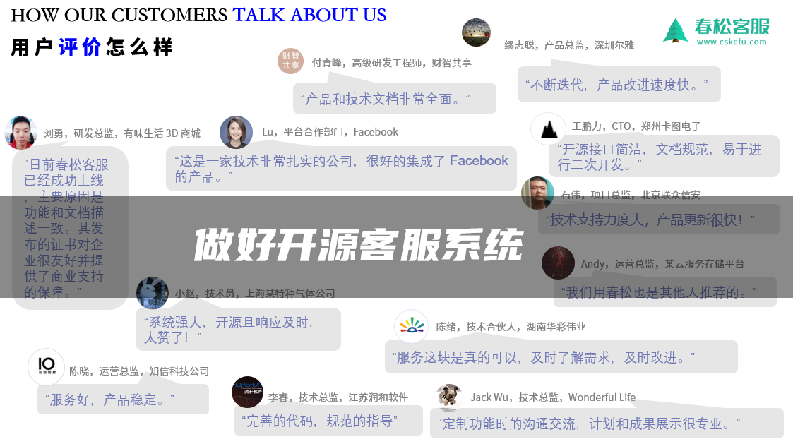

[主页](https://www.cskefu.com/)　|　[成功案例](#客户案例)　|　[开发者文档](https://docs.chatopera.com/products/cskefu/osc/index.html)　|　[博客专栏](https://chatopera.blog.csdn.net/)　|　[更新日志](./CHANGELOG.md)　|　[帮助](https://github.com/chatopera/cskefu/issues)

# 春松客服：做好开源客服系统

       

[https://www.cskefu.com](https://www.cskefu.com/)

:evergreen_tree: 春松客服是 [Chatopera](https://www.chatopera.com/) 发布的开源并且免费的智能客服系统 / CSKeFu is a Customer Support System for Enterprises in a High Performance Low-Touch way, OpenSource and Free for the world by [Chatopera](https://www.chatopera.com/).

在 Chatopera，我们相信：**越是重视客户服务，越是好的企业 / the more you care about your customers, the better income you earn in return**。

:hearts: 我们发布春松客服的愿景 / Our vision on CSKeFu:

- 做好开源客服系统 / Deliver Open Source Contact Center with High Quality
- 帮助企业快速获得开箱即用的免费智能客服系统 / Get Customer Support System in minutes
- 成为开发者首选的客服系统开发框架 / To be Top 1 Framework for Customer Support System Customization

:innocent: 我们对春松客服客户的承诺 / Our promise on CSKeFu:

- 我们不发布垃圾 / We don't ship junk
- 持续优化春松客服 / Keep on coming with great enhancements in the long term
- 坚持开源和免费，商业友好授权 / OpenSource for the world with license which is business friendly

  

其它播放地址：[微信公众号](https://mp.weixin.qq.com/s/ixFg3zVJP07e9EPQRPq2UQ) | [YouTube](https://youtu.be/ILf3BWpq4Ns)

新版本介绍：[一山还有一山高，开源智能客服系统春松客服 v7 版本发布 | Chatopera](https://chatopera.blog.csdn.net/article/details/113786505)

## 媒体报道

- [春松客服荣获 GVP 企业级开源项目认证](http://www.ctiforum.com/news/guonei/578988.html)

- [GitHub 上获点赞最多的开源客服系统春松客服入驻 CODE CHINA](https://mp.weixin.qq.com/s/wGCFj9Hs1uVuTQCTqH0IWg)

- [Coscon'19 中国开源年会春松客服主题分享](https://www.shangyexinzhi.com/article/351121.html)

---

## 客户案例

  <b>:briefcase: TA 们都选择春松客服</b> 
  

## 客户反馈

  <b>:yum: TA 们这样评价春松客服</b> 
  

## 产品演示

### 坐席工作台

[https://cc.chatopera.com/](https://cc.chatopera.com/)

| **登录账号** | **密码**  |
| ------------ | --------- |
| admin        | admin1234 |

### 网页端访客程序

[https://cc.chatopera.com/testclient.html](http://cc.chatopera.com/testclient.html)

### 机器人客服示例程序

[https://oh-my.cskefu.com/im/text/0nhckh.html](https://oh-my.cskefu.com/im/text/0nhckh.html)

## 功能介绍

### 免费模块

春松客服提供的开源代码，即[CSKeFu](https://github.com/chatopera/cskefu)，包含多个开箱即用的模块：

- 账号及组织机构管理：按组织、角色分配账号权限

- 坐席监控：设置坐席监控角色的人员可以看到并干预访客会话

- 联系人和客户管理：细粒度维护客户信息，自定义标签和打标签，记录来往历史等

- 网页聊天组件：一分钟接入对话窗口，支持技能组、邀请和关联联系人等

- 坐席工作台：汇聚多渠道访客请求，坐席根据策略自动分配，自动弹屏，转接等

- 机器人客服：集成 [Chatopera 云服务](https://bot.chatopera.com)，利用 Chatopera 强大的聊天机器人解决方案，提升客户服务工作中的自动化、智能化；机器人客服插件既能通过知识库联想，知识库快捷支持坐席人员，也可以直接为访客提供查询、数据收集等功能；通过插件形式安装，插件也以开源形式提供，[查看插件源码](./public/plugins)。

- 企业聊天：支持企业员工在春松客服系统中群聊和私聊

- 质检：历史会话、服务小结、服务反馈及相关报表

### 付费模块

**春松客服从 v5.0.0 版本开始提供如下付费模块：**

- Messenger 渠道：集成 [Facebook Messenger Platform](https://docs.chatopera.com/products/cskefu/channels/messenger/index.html)，在 Facebook 全家桶中连接亿万消费者、买家

付费模块代码并不开源，并且使用插件的形式安装在源码中，[请联系“商务洽谈”](https://www.chatopera.com/mail.html)获得插件和商业支持。

## 产品文档

关于产品的具体使用说明，请参考[文档中心](https://docs.chatopera.com/products/cskefu/index.html)。

### 产品截图

  <b>欢迎页</b> 
  

展开查看更多产品截图

  <b>坐席工作台</b> 
  

  <b>坐席监控</b> 
  

  <b>集成客服机器人</b> 
  

  <b>客服机器人应答</b> 
  

  <b>更多功能，敬请期待 ...</b> 
  

## 私有部署

容器化一键部署，现在就使用春松客服！参考[《私有部署文档》](https://docs.chatopera.com/products/cskefu/deploy.html)。

## 机器人客服

**超过 85% 的春松客服企业客户通过 Chatopera 云服务上线机器人客服！7x24 小时在线，接待访客，辅助人工坐席，提升 10 倍工作效率。**

Chatopera 机器人平台包括知识库、多轮对话、意图识别和语音识别等组件，标准化聊天机器人开发，支持企业 OA 智能问答、HR 智能问答、智能客服和网络营销等场景。企业 IT 部门、业务部门借助 Chatopera 云服务快速让聊天机器人上线！

### 机器人客服示例程序

[https://oh-my.cskefu.com/im/text/0nhckh.html](https://oh-my.cskefu.com/im/text/0nhckh.html)

### 立即上线机器人客服

上线机器人客服的两个方式：1）Chatopera 云服务，按量付费，提供每日免费额度；2）私有部署。

查看文档[《立即上线机器人客服》](https://docs.chatopera.com/products/cskefu/work-chatbot/bot-agent.html)。

  

展开查看 Chatopera 云服务的产品截图

  <b>自定义词典</b> 
  

  <b>自定义词条</b> 
  

  <b>创建意图</b> 
  

  <b>添加说法和槽位</b> 
  

  <b>训练模型</b> 
  

  <b>测试对话</b> 
  

  <b>机器人画像</b> 
  

  <b>系统集成</b> 
  

  <b>聊天历史</b> 
  

## 开发者社区

### 开源项目地址

[Github](https://github.com/chatopera/cskefu) | [Gitee](https://gitee.com/chatopera/cskefu) | [CodeChina](https://codechina.csdn.net/chatopera/cskefu)

### 社区支持

- [Help: 开发环境搭建、功能咨询和使用问题等](https://github.com/chatopera/cskefu/issues/new?assignees=hailiang-wang&labels=help-wanted&template=1_help.md&title=Title%3A+%E7%94%A8%E4%B8%80%E5%8F%A5%E8%AF%9D%E9%99%88%E8%BF%B0%E4%BA%8B%E6%83%85%EF%BC%8C%E4%BF%9D%E8%AF%81%E8%A8%80%E7%AE%80%E6%84%8F%E8%B5%85%EF%BC%8C%E6%AF%94%E5%A6%82%E9%97%AE%E9%A2%98%E7%AE%80%E8%BF%B0%E5%8F%8A+root+cause+%E6%97%A5%E5%BF%97%E8%AF%AD%E5%8F%A5%EF%BC%8C%E6%9B%B4%E5%AE%B9%E6%98%93%E8%8E%B7%E5%BE%97%E5%B8%AE%E5%8A%A9)
- [Bug: 提交软件缺陷](https://github.com/chatopera/cskefu/issues/new?assignees=hailiang-wang&labels=bug&template=2_bug_report.md&title=Title%3A+%E7%94%A8%E4%B8%80%E5%8F%A5%E8%AF%9D%E9%99%88%E8%BF%B0%E4%BA%8B%E6%83%85%EF%BC%8C%E4%BF%9D%E8%AF%81%E8%A8%80%E7%AE%80%E6%84%8F%E8%B5%85%EF%BC%8C%E6%AF%94%E5%A6%82%E9%97%AE%E9%A2%98%E7%AE%80%E8%BF%B0%E5%8F%8A+root+cause+%E6%97%A5%E5%BF%97%E8%AF%AD%E5%8F%A5%EF%BC%8C%E6%9B%B4%E5%AE%B9%E6%98%93%E8%8E%B7%E5%BE%97%E5%B8%AE%E5%8A%A9)
- [Requirement: 描述新需求、反馈建议](https://github.com/chatopera/cskefu/issues/new?assignees=hailiang-wang&labels=requirement&template=3_requirement.md&title=Title%3A+%E7%94%A8%E4%B8%80%E5%8F%A5%E8%AF%9D%E9%99%88%E8%BF%B0%E4%BA%8B%E6%83%85%EF%BC%8C%E4%BF%9D%E8%AF%81%E8%A8%80%E7%AE%80%E6%84%8F%E8%B5%85%EF%BC%8C%E6%AF%94%E5%A6%82%E9%97%AE%E9%A2%98%E7%AE%80%E8%BF%B0%E5%8F%8A+root+cause+%E6%97%A5%E5%BF%97%E8%AF%AD%E5%8F%A5%EF%BC%8C%E6%9B%B4%E5%AE%B9%E6%98%93%E8%8E%B7%E5%BE%97%E5%B8%AE%E5%8A%A9)
- [Profiling: 瓶颈分析、性能优化建议和安全漏洞等](https://github.com/chatopera/cskefu/issues/new?assignees=hailiang-wang&labels=profiling&template=4_profiling.md&title=Title%3A+%E7%94%A8%E4%B8%80%E5%8F%A5%E8%AF%9D%E9%99%88%E8%BF%B0%E4%BA%8B%E6%83%85%EF%BC%8C%E4%BF%9D%E8%AF%81%E8%A8%80%E7%AE%80%E6%84%8F%E8%B5%85%EF%BC%8C%E6%AF%94%E5%A6%82%E9%97%AE%E9%A2%98%E7%AE%80%E8%BF%B0%E5%8F%8A+root+cause+%E6%97%A5%E5%BF%97%E8%AF%AD%E5%8F%A5%EF%BC%8C%E6%9B%B4%E5%AE%B9%E6%98%93%E8%8E%B7%E5%BE%97%E5%B8%AE%E5%8A%A9)

### 用户交流群

  <b>在 Chatopera 客户群中也包括其他用户，请不要发送敏感信息。讨论与 Chatopera 产品和服务相关的事宜</b> 

更多开发者社区介绍，查看：[https://docs.chatopera.com/products/cskefu/osc/index.html](https://docs.chatopera.com/products/cskefu/osc/index.html)

## 运营及定制开发技能培训

### 在线培训视频

[春松客服大讲堂](https://ke.qq.com/course/464050)是面向企业 CTO、客服主管、客服及客服系统开发运维人员的在线课程，紧紧围绕春松客服开源代码，由浅入深的介绍春松客服**上线智能客服系统**、**运营客服工作**和**二次开发**的知识。

<table>
  <tr>
    <th>节</th>
    <th>任务</th>
    <th>时长（时:分:秒）</th>
  </tr>
  <tr>
    <td rowspan="3">一、春松客服的介绍</td>
    <td><a href="https://ke.qq.com/webcourse/index.html#cid=464050&term_id=100555327&taid=4785478331471026&type=1024&vid=5285890796113543115">【免费】如何使用Java开发智能客服系统</a></td>
    <td>00:32:11</td>
  </tr>
  <tr>
    <td><a href="https://ke.qq.com/webcourse/index.html#cid=464050&term_id=100555327&taid=4785482626438322&type=1024&vid=5285890796174208504">【免费】春松客服在企业的落地</a></td>
    <td>00:30:41</td>
  </tr>
  <tr>
    <td><a href="https://ke.qq.com/webcourse/index.html#cid=464050&term_id=100555327&taid=4785486921405618&type=1024&vid=5285890796206187829">春松客服的技术介绍</a></td>
    <td>01:09:30</td>
  </tr>
  <tr>
    <td rowspan="7">二、客服相关的基本知识</td>
    <td><a href="https://ke.qq.com/webcourse/index.html#cid=464050&term_id=100555327&taid=4785491216372914&type=1024&vid=5285890796236118691">客服的日常工作</a></td>
    <td>00:57:35</td>
  </tr>
  <tr>
    <td><a href="https://ke.qq.com/webcourse/index.html#cid=464050&term_id=100555327&taid=4785495511340210&type=1024&vid=5285890796265703352">客服的基本知识</a></td>
    <td>00:46:48</td>
  </tr>
  <tr>
    <td><a href="https://ke.qq.com/webcourse/index.html#cid=464050&term_id=100555327&taid=4785499806307506&type=1024&vid=5285890796295538521">账号体系-组织、权限，部门和角色</a></td>
    <td>00:42:06</td>
  </tr>
  <tr>
    <td><a href="https://ke.qq.com/webcourse/index.html#cid=464050&term_id=100555327&taid=4785504101274802&type=1024&vid=5285890796326774174">坐席会话的工具-拉黑，服务小结和转接</a></td>
    <td>00:33:00</td>
  </tr>
  <tr>
    <td><a href="https://ke.qq.com/webcourse/index.html#cid=464050&term_id=100555327&taid=4785508396242098&type=1024&vid=5285890796387973179">即时通信 IM（SocketIO）及坐席自动分配 ACD</a></td>
    <td>00:56:50</td>
  </tr>
  <tr>
    <td><a href="https://ke.qq.com/webcourse/index.html#cid=464050&term_id=100555327&taid=4785538461013170&type=1024&vid=5285890796727947677">企业内部聊天与人工质检</a></td>
    <td>00:35:12</td>
  </tr>
  <tr>
    <td><a href="https://ke.qq.com/webcourse/index.html#cid=464050&term_id=100555327&taid=4785542755980466&type=1024&vid=5285890796727887112">统计报表和满意度评价</a></td>
    <td>00:37:18</td>
  </tr>
  <tr>
    <td rowspan="6">三、春松客服的上线及维护</td>
    <td><a href="https://ke.qq.com/webcourse/index.html#cid=464050&term_id=100555327&taid=4785512691209394&type=1024&vid=5285890796417069415">春松客服的编译和部署</a></td>
    <td>00:38:27</td>
  </tr>
  <tr>
    <td><a href="https://ke.qq.com/webcourse/index.html#cid=464050&term_id=100555327&taid=4785516986176690&type=1024&vid=5285890796447482734">春松客服的 Docker 容器化运维管理</a></td>
    <td>01:00:37</td>
  </tr>
  <tr>
    <td><a href="https://ke.qq.com/webcourse/index.html#cid=464050&term_id=100555327&taid=4785521281143986&type=1024&vid=5285890796596887008">春松客服的 Selenium 自动化系统测试（1）</a></td>
    <td>00:32:45</td>
  </tr>
  <tr>
    <td><a href="https://ke.qq.com/webcourse/index.html#cid=464050&term_id=100555327&taid=4785534166045874&type=1024&vid=5285890796596824768">春松客服的 Selenium 自动化系统测试（2）</a></td>
    <td>00:49:20</td>
  </tr>
  <tr>
    <td><a href="https://ke.qq.com/webcourse/index.html#cid=464050&term_id=100555327&taid=4785525576111282&type=1024&vid=5285890796625584882">春松客服的 jMeter 压力测试（1）</a></td>
    <td>00:42:33</td>
  </tr>
  <tr>
    <td><a href="https://ke.qq.com/webcourse/index.html#cid=464050&term_id=100555327&taid=4785529871078578&type=1024&vid=5285890796625353569">春松客服的 jMeter 压力测试（2）</a></td>
    <td>00:40:39</td>
  </tr>
  <tr>
    <td rowspan="3">四、春松客服的机器人客服</td>
    <td><a href="https://ke.qq.com/webcourse/index.html#cid=464050&term_id=100555327&taid=4785564230816946&type=1024&vid=5285890797022829695">Chatopera 云服务介绍</a></td>
    <td>00:28:01</td>
  </tr>
  <tr>
    <td><a href="https://ke.qq.com/webcourse/index.html#cid=464050&term_id=100555327&taid=4785568525784242&type=1024&vid=5285890797022829724">机器人的知识库 FAQ 管理</a></td>
    <td>00:47:56</td>
  </tr>
  <tr>
    <td><a href="https://ke.qq.com/webcourse/index.html#cid=464050&term_id=100555327&taid=4785572820751538&type=1024&vid=5285890797022759383">机器人的多轮对话及富文本消息类型</a></td>
    <td>00:43:32</td>
  </tr>
  <tr>
    <td rowspan="8">五、春松客服开发基础知识</td>
    <td><a href="https://ke.qq.com/webcourse/index.html#cid=464050&term_id=100555327&taid=4785547050947762&type=1024&vid=5285890796845383231">SQL 快速入门</a></td>
    <td>00:46:39</td>
  </tr>
  <tr>
    <td><a href="https://ke.qq.com/webcourse/index.html#cid=464050&term_id=100555327&taid=4785551345915058&type=1024&vid=5285890796845241957">春松客服 MySQL 数据库表及管理</a></td>
    <td>00:45:30</td>
  </tr>
  <tr>
    <td><a href="https://ke.qq.com/webcourse/index.html#cid=464050&term_id=100555327&taid=4785555640882354&type=1024&vid=5285890796905914800">Java 编程基础（1）</a></td>
    <td>00:45:24</td>
  </tr>
  <tr>
    <td><a href="https://ke.qq.com/webcourse/index.html#cid=464050&term_id=100555327&taid=4785559935849650&type=1024&vid=5285890796905985344">Java 编程基础（2）</a></td>
    <td>01:37:53</td>
  </tr>
  <tr>
    <td><a href="https://ke.qq.com/webcourse/index.html#cid=464050&term_id=100555327&taid=4785585705653426&type=1024&vid=5285890796934211686">Maven 项目管理</a></td>
    <td>00:46:18</td>
  </tr>
  <tr>
    <td><a href="https://ke.qq.com/webcourse/index.html#cid=464050&term_id=100555327&taid=4785590000620722&type=1024&vid=5285890796934221816">搭建春松客服 Intellij IDEA 开发环境</a></td>
    <td>01:10:28</td>
  </tr>
  <tr>
    <td><a href="https://ke.qq.com/webcourse/index.html#cid=464050&term_id=100555327&taid=4785581410686130&type=1024&vid=5285890797139512901">SpringBoot 快速入门</a></td>
    <td>00:45:50</td>
  </tr>
  <tr>
    <td><a href="https://ke.qq.com/webcourse/index.html#cid=464050&term_id=100555327&taid=4785577115718834&type=1024&vid=5285890797139362028">项目 Java 源码讲解</a></td>
    <td>01:09:40</td>
  </tr>
  <tr>
    <td rowspan="2">六、春松客服的插件</td>
    <td><a href="https://ke.qq.com/webcourse/index.html#cid=464050&term_id=100555327&taid=4785602885522610&type=1024&vid=5285890797257275471">春松客服 Plugin 机制设计</a></td>
    <td>00:45:51</td>
  </tr>
  <tr>
    <td><a href="https://ke.qq.com/webcourse/index.html#cid=464050&term_id=100555327&taid=4785607180489906&type=1024&vid=5285890797257416124">春松机器人客服插件解读</a></td>
    <td>00:41:20</td>
  </tr>
  <tr>
    <td>七、总结</td>
    <td><a href="https://ke.qq.com/webcourse/index.html#cid=464050&term_id=100555327&taid=4785611475457202&type=1024&vid=5285890797257385985">春松客服团队介绍及课程总结</a></td>
    <td>00:32:11</td>
  </tr>
</table>

**提示**：本在线课程使用腾讯课堂服务；课程包括免费内容和付费内容，购买后可联系电话 <a href="tel:15210018430"> (+86)152-1001-8430</a> 开发票；课程内容以上面标题为准，腾讯课堂上的标题与真实内容不完全匹配。

课程观看截止时间参考[页面](https://ke.qq.com/course/464050)内的上课时间，逾期后课程下线。遇到问题可在 [Chatopera 用户交流群](#用户交流群)内交流。

### 开发者文档

  <b><a href="https://docs.chatopera.com/products/cskefu/osc/engineering.html" target="_blank">开发者文档</a></b> 
  

### 认证开发者

春松客服开发者是具备春松客服定制化开发智能客服系统技能，具备丰富的专业经验的软件工程师，由 Chatopera 通过访谈的形式确认其在某行业或某企业内完成春松客服上线、定制化春松客服。

| Avatar                                                                                            | Name | GitHub                            | Talk                                                    | Intro.                                                                                                                                   |
| ------------------------------------------------------------------------------------------------- | ---- | --------------------------------- | ------------------------------------------------------- | ---------------------------------------------------------------------------------------------------------------------------------------- |
|  | 刘勇 | [lecjy](https://github.com/lecjy) | [报道](http://www.ctiforum.com/news/guonei/579599.html) | 目前工作于湖北武汉一个电商企业，曾就职于京东海外电商平台，负责客户系统维护，对于电商客服领域有丰富的工作经验，尤其是面向东南亚出海业务。 |

寻找基于春松客服搭建智能客服系统的客户，包括但不限于部署、系统集成和定制开发等，可以优先考虑联系以上认证开发者，Chatopera 团队会持续维护基础模块、云服务和机器人客服，提升春松客服上利用人工智能、机器学习和自动化流程服务。

**寻找开发者合作智能客服项目，社区共建，携手共赢！**

- 组织或个人，在春松客服主页展示为认证开发者
- 春松客服官方推荐项目机会
- 专访并通过官方渠道曝光

填写申请：[http://chatopera.mikecrm.com/tMUtj1z](http://chatopera.mikecrm.com/tMUtj1z)

## 鸣谢

[IBM Cloud 赞助春松客服服务器资源 12W US Dollar（2019 年度）](https://cloud.ibm.com/)

[Amazon AWS 赞助春松客服服务器资源 5W RMB（2021 年度）](https://aws.amazon.com)

## 开源许可协议

Copyright (2018-2021) <a href="https://www.chatopera.com/" target="_blank">北京华夏春松科技有限公司</a>

[Apache License Version 2.0](https://github.com/chatopera/cskefu/blob/osc/LICENSE)

