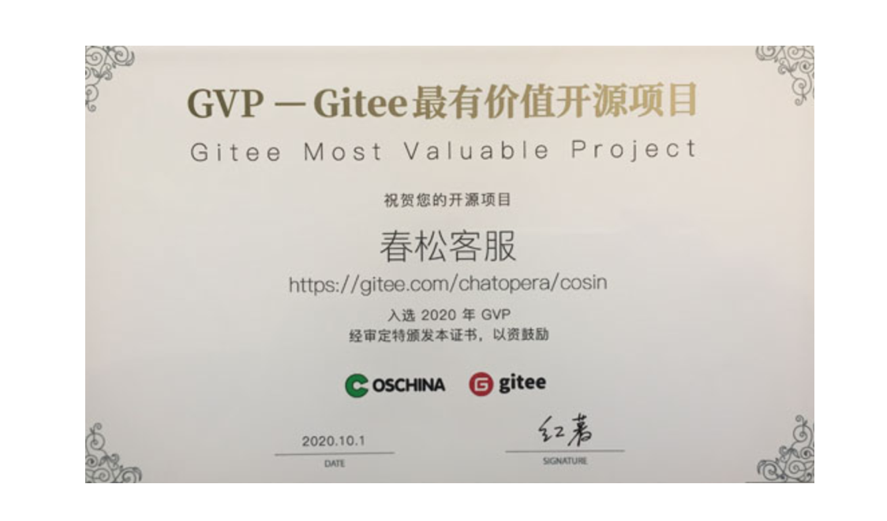
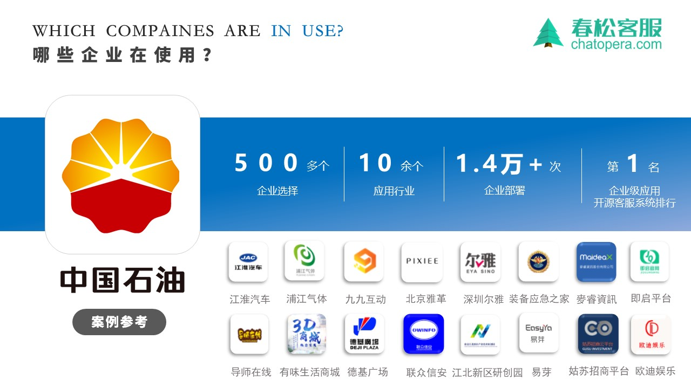
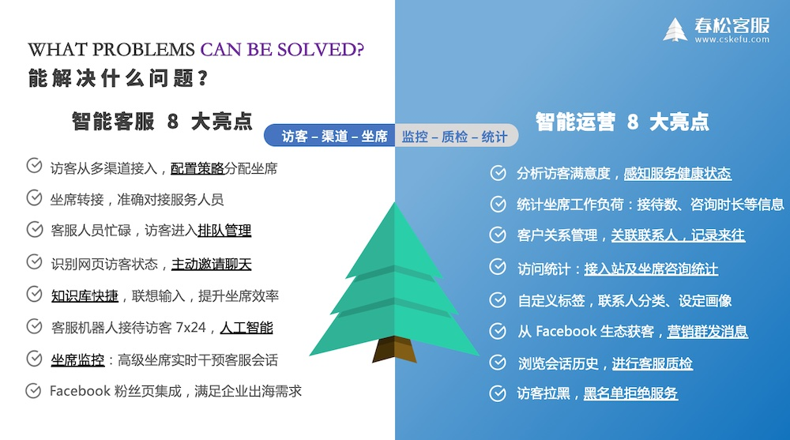
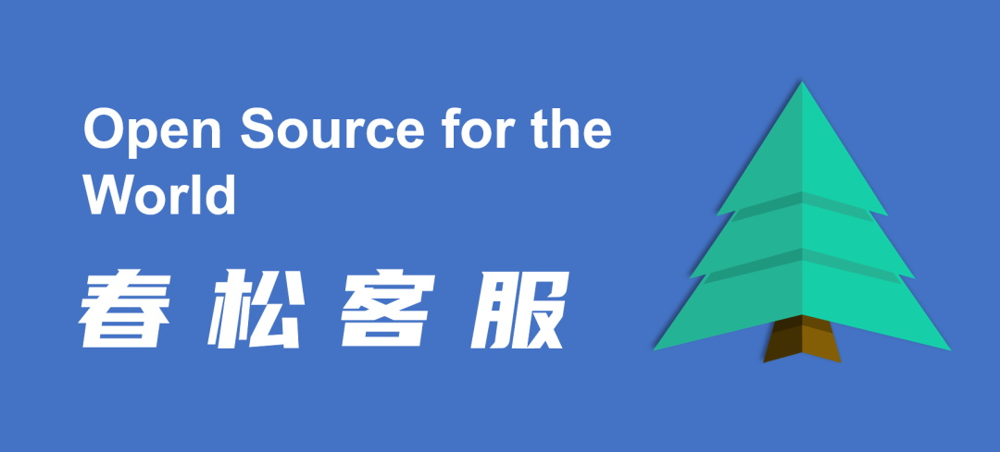

[主页](https://www.cskefu.com/)　|　[邮件列表](https://lists.cskefu.com/cgi-bin/mailman/listinfo/dev)　|　[博客专栏](https://chatopera.blog.csdn.net/)　|　[开源之夏](https://www.cskefu.com/summercode/)

# 春松客服：合作开源客服系统，共赢未来！

       <!-- ALL-CONTRIBUTORS-BADGE:START - Do not remove or modify this section -->

<!-- ALL-CONTRIBUTORS-BADGE:END -->

[https://www.cskefu.com](https://www.cskefu.com/) | [Github](https://github.com/chatopera/cskefu) | [Gitee](https://gitee.com/chatopera/cskefu) | [GitCode](https://gitcode.net/chatopera/cskefu)

:evergreen_tree: 春松客服是开源的智能客服系统，于 2018 年 9 月由 [Chatopera](https://www.chatopera.com) 发布，在开源社区协作中优化和完善，春松客服属于[春松客服开源社区](https://github.com/chatopera/cskefu#%E6%98%A5%E6%9D%BE%E5%AE%A2%E6%9C%8D%E5%BC%80%E6%BA%90%E7%A4%BE%E5%8C%BA)。

:hearts: 春松客服的愿景：

- 做好开源客服系统及其商业支持
- 帮助企业快速获得开箱即用的智能客服系统
- 成为开发者首选的客服系统开发框架

:innocent: 春松客服的承诺:

- 坚持基础功能开源，不发布垃圾
- 坚持持续优化
- 坚持商业友好授权

春松客服宣言视频： [Bilibili](https://www.bilibili.com/video/BV1hu411o76r/) | [YouTube](https://youtu.be/ILf3BWpq4Ns)

新版本介绍：[一山还有一山高，开源智能客服系统春松客服 v7 版本发布 | Chatopera](https://chatopera.blog.csdn.net/article/details/113786505)

## 媒体报道

- [春松客服：通过开源加云原生模式，大规模交付智能客服系统](https://www.cskefu.com/2022/04/11/cskefu-opensource-plus-cloud-model/)

- [春松客服荣获 GVP 企业级开源项目认证](http://www.ctiforum.com/news/guonei/578988.html)

- [Chatopera 王海良：做好开源客服系统 | OpenTEKr 专访](https://www.bilibili.com/video/BV1qF411p7hW)

---

## 客户案例

  <b>:briefcase: 大家都选择春松客服</b> 
  

## 功能介绍

<!--  -->

春松客服提供的开源代码，即[CSKeFu](https://github.com/chatopera/cskefu)，包含多个开箱即用的模块：

- 账号及组织机构管理：按组织、角色分配账号权限

- 访客渠道：支持 H5、PC 浏览器和[微信小程序原生](https://github.com/chatopera/cskefu-wxapp)；一分钟接入对话窗口，支持技能组、邀请和关联联系人等

- 联系人和客户管理：细粒度维护客户信息，自定义标签和打标签，记录来往历史等

- 坐席监控：设置坐席监控角色的人员可以看到并干预访客会话

- 坐席工作台：汇聚多渠道访客请求，坐席根据策略自动分配，自动弹屏，转接等

- 机器人客服：集成 [Chatopera 云服务](https://bot.chatopera.com)，利用 Chatopera 强大的聊天机器人解决方案，提升客户服务工作中的自动化、智能化；机器人客服插件既能通过知识库联想，知识库快捷支持坐席人员，也可以直接为访客提供查询、数据收集等功能；通过插件形式安装，插件也以开源形式提供，[查看插件源码](./public/plugins)。

- 企业聊天：支持企业员工在春松客服系统中群聊和私聊

- 质检：历史会话、服务小结、服务反馈及相关报表

## 产品演示

  <b>欢迎页</b> 
  

展开查看更多产品截图

  <b>坐席工作台</b> 
  

  <b>坐席监控</b> 
  

  <b>集成客服机器人</b> 
  

  <b>客服机器人应答</b> 
  

### 坐席工作台

[https://cc.chatopera.com/](https://cc.chatopera.com/)

| **登录账号** | **密码**  | **角色** |
| ------------ | --------- | --------- |
| admin        | admin1234 | 系统超级管理员 |
| zhangsan        | agent1234 | 客服坐席人员 |

### 网页端访客示例

[https://cc.chatopera.com/testclient.html](http://cc.chatopera.com/testclient.html)

- 登录张三后可接待访客，否则显示没有客服人员在线

### 机器人客服示例

[https://oh-my.cskefu.com/im/text/0nhckh.html](https://oh-my.cskefu.com/im/text/0nhckh.html)

## 快速开始

### 安装部署

容器化一键部署，现在就使用春松客服！参考[《私有部署文档》](https://docs.chatopera.com/products/cskefu/deploy.html)。

### 系统初始化

部署后，进行系统初始化，为组织设定部门、权限、账号等，参考[《系统初始化文档》](https://docs.chatopera.com/products/cskefu/initialization.html)。

### 运维

备份、升级、回滚等运维工作，参考[《系统维护文档》](https://docs.chatopera.com/products/cskefu/osc/maintainence.html)。

### 运营使用指南

关于产品的具体使用说明，请参考[《春松客服文档》](https://docs.chatopera.com/products/cskefu/index.html)。

### 立即上线机器人客服

超过 85% 的春松客服企业客户通过 Chatopera 云服务上线机器人客服！7x24 小时在线，接待访客，辅助人工坐席，提升 10 倍工作效率。Chatopera 机器人平台包括知识库、多轮对话、意图识别和语音识别等组件，标准化聊天机器人开发。

- [春松客服安装机器人客服插件](https://docs.chatopera.com/products/cskefu/work-chatbot/install.html)
- [集成 Chatopera 云服务](https://docs.chatopera.com/products/cskefu/work-chatbot/bot-agent.html)
- [设定知识库、对话技能：欢迎语、按钮、图文消息等](https://docs.chatopera.com/products/cskefu/work-chatbot/message-types.html)

展开查看更多机器人客服介绍

  <b>应用场景示例</b> 
  

支持企业 OA 智能问答、HR 智能问答、智能客服和网络营销等场景。企业 IT 部门、业务部门借助 Chatopera 云服务快速让聊天机器人上线！
上线机器人客服的两个方式：1）Chatopera 云服务，按量付费，提供每日免费额度；2）私有部署。

## 春松客服开源社区

### 合作开源客服系统，共赢未来！

春松客服之所以开源，是基于这样一种信念：爱人也是爱己，利他也是利己。
对人和人美好关系的向往，对人潜力的信任。让我们相信因春松客服而受益的人，会回报给春松客服开源社区，我们[所有贡献者](#贡献者列表)基于共赢的信念合作。
回报方式包括：[提交 PR](https://github.com/chatopera/cskefu/blob/osc/CONTRIBUTING.md)、购买春松客服相关的[付费产品和服务](https://www.chatopera.com/price.html)等。

因春松客服受益，而不回报开源社区的用户，我们不欢迎使用春松客服：我们开源并不是为了你们，你们是不被祝福的。

### 成为春松客服贡献者

- 如何提交反馈、文档，参考[文档](./CONTRIBUTING.md)
- 如何提交代码，参考[文档](https://docs.chatopera.com/products/cskefu/osc/contribution.html)
- 如何参与春松客服社区活动：[成为春松客服开源之夏2022导师，火热招募中 🔥 🔥 🔥 ](https://github.com/chatopera/cskefu/issues/673)
- 如何最新的春松客服开发进展：订阅[春松客服邮件列表](https://lists.cskefu.com/cgi-bin/mailman/listinfo/dev)

### 贡献者列表 ✨

“投我以木桃，报之以琼瑶。匪报也，永以为好也！”，这是来自 3000 年前《诗经·木瓜》。

<!-- ALL-CONTRIBUTORS-LIST:START - Do not remove or modify this section -->
<!-- prettier-ignore-start -->
<!-- markdownlint-disable -->
<table>
  <tr>
    <td align="center"><a href="https://github.com/mukaiu"> <b>Mukaiu</b></a> <a href="https://github.com/chatopera/cskefu/commits?author=mukaiu" title="Code">💻</a> <a href="#infra-mukaiu" title="Infrastructure (Hosting, Build-Tools, etc)">🚇</a></td>
    <td align="center"><a href="https://www.linkedin.com/in/hai-liang-wang/"> <b>Hai Liang W.</b></a> <a href="#plugin-hailiang-wang" title="Plugin/utility libraries">🔌</a> <a href="#financial-hailiang-wang" title="Financial">💵</a></td>
    <td align="center"><a href="https://github.com/shih945"> <b>SHIH</b></a> <a href="https://github.com/chatopera/cskefu/commits?author=shih945" title="Code">💻</a></td>
    <td align="center"><a href="https://github.com/luruiGit"> <b>luruiGit</b></a> <a href="https://github.com/chatopera/cskefu/commits?author=luruiGit" title="Code">💻</a></td>
    <td align="center"><a href="http://enze5088.github.io"> <b>Enze</b></a> <a href="https://github.com/chatopera/cskefu/commits?author=enze5088" title="Code">💻</a></td>
    <td align="center"><a href="https://blog.dengchao.fun"> <b>邓超</b></a> <a href="https://github.com/chatopera/cskefu/commits?author=DevDengChao" title="Code">💻</a></td>
    <td align="center"><a href="https://github.com/Happy5"> <b>Happy5</b></a> <a href="#ideas-Happy5" title="Ideas, Planning, & Feedback">🤔</a></td>
    <td align="center"><a href="https://www.csdn.net"> <b>kyle</b></a> <a href="https://github.com/chatopera/cskefu/commits?author=kylezhang" title="Code">💻</a> <a href="#talk-kylezhang" title="Talks">📢</a></td>
    <td align="center"><a href="https://github.com/xianliwang"> <b>xianliwang</b></a> <a href="#video-xianliwang" title="Videos">📹</a> <a href="https://github.com/chatopera/cskefu/commits?author=xianliwang" title="Tests">⚠️</a></td>
  </tr>
  <tr>
    <td align="center"><a href="https://github.com/lihang2016"> <b>lihang2016</b></a> <a href="#ideas-lihang2016" title="Ideas, Planning, & Feedback">🤔</a></td>
    <td align="center"><a href="https://github.com/live-in-the-moment"> <b>live-in-the-moment</b></a> <a href="#ideas-live-in-the-moment" title="Ideas, Planning, & Feedback">🤔</a> <a href="https://github.com/chatopera/cskefu/issues?q=author%3Alive-in-the-moment" title="Bug reports">🐛</a> <a href="https://github.com/chatopera/cskefu/commits?author=live-in-the-moment" title="Tests">⚠️</a></td>
    <td align="center"><a href="https://github.com/ArioWei"> <b>ArioWei</b></a> <a href="https://github.com/chatopera/cskefu/commits?author=ArioWei" title="Tests">⚠️</a></td>
    <td align="center"><a href="http://www.youkefu.cn"> <b>优客服</b></a> <a href="https://github.com/chatopera/cskefu/commits?author=youkefu" title="Code">💻</a> <a href="https://github.com/chatopera/cskefu/commits?author=youkefu" title="Tests">⚠️</a> <a href="#business-youkefu" title="Business development">💼</a> <a href="#design-youkefu" title="Design">🎨</a></td>
    <td align="center"><a href="https://github.com/lecjy"> <b>lecjy</b></a> <a href="#ideas-lecjy" title="Ideas, Planning, & Feedback">🤔</a> <a href="#talk-lecjy" title="Talks">📢</a></td>
    <td align="center"><a href="https://github.com/xl111"> <b>徐。。</b></a> <a href="https://github.com/chatopera/cskefu/commits?author=xl111" title="Code">💻</a></td>
    <td align="center"><a href="https://github.com/viaco2ove"> <b>viaco2ove</b></a> <a href="https://github.com/chatopera/cskefu/commits?author=viaco2ove" title="Code">💻</a></td>
    <td align="center"><a href="https://github.com/understanding"> <b>understanding</b></a> <a href="https://github.com/chatopera/cskefu/commits?author=understanding" title="Tests">⚠️</a></td>
    <td align="center"><a href="https://github.com/MQPearth"> <b>MQPearth</b></a> <a href="https://github.com/chatopera/cskefu/commits?author=MQPearth" title="Tests">⚠️</a></td>
  </tr>
  <tr>
    <td align="center"><a href="https://github.com/SkorpiosL"> <b>SkorpiosL</b></a> <a href="https://github.com/chatopera/cskefu/commits?author=SkorpiosL" title="Tests">⚠️</a></td>
    <td align="center"><a href="https://github.com/always-China"> <b>hua</b></a> <a href="https://github.com/chatopera/cskefu/commits?author=always-China" title="Code">💻</a></td>
    <td align="center"><a href="https://github.com/wq11123"> <b>wq11123</b></a> <a href="https://github.com/chatopera/cskefu/commits?author=wq11123" title="Tests">⚠️</a> <a href="#video-wq11123" title="Videos">📹</a> <a href="#ideas-wq11123" title="Ideas, Planning, & Feedback">🤔</a></td>
    <td align="center"><a href="https://github.com/MouMouQQ"> <b>MouMouQQ</b></a> <a href="#ideas-MouMouQQ" title="Ideas, Planning, & Feedback">🤔</a> <a href="https://github.com/chatopera/cskefu/commits?author=MouMouQQ" title="Tests">⚠️</a></td>
    <td align="center"><a href="https://github.com/tigerun"> <b>Tigerun</b></a> <a href="#ideas-tigerun" title="Ideas, Planning, & Feedback">🤔</a></td>
    <td align="center"><a href="https://github.com/yangbailiang"> <b>yangbailiang</b></a> <a href="https://github.com/chatopera/cskefu/issues?q=author%3Ayangbailiang" title="Bug reports">🐛</a> <a href="https://github.com/chatopera/cskefu/commits?author=yangbailiang" title="Tests">⚠️</a></td>
    <td align="center"><a href="https://github.com/lokywang"> <b>lokywang</b></a> <a href="#ideas-lokywang" title="Ideas, Planning, & Feedback">🤔</a></td>
    <td align="center"><a href="https://github.com/jichoucc"> <b>jichoucc</b></a> <a href="https://github.com/chatopera/cskefu/issues?q=author%3Ajichoucc" title="Bug reports">🐛</a> <a href="https://github.com/chatopera/cskefu/commits?author=jichoucc" title="Tests">⚠️</a></td>
    <td align="center"><a href="https://github.com/wuyongyin"> <b>wuyongyin</b></a> <a href="#ideas-wuyongyin" title="Ideas, Planning, & Feedback">🤔</a></td>
  </tr>
  <tr>
    <td align="center"><a href="https://github.com/wangdayan"> <b>Claire</b></a> <a href="https://github.com/chatopera/cskefu/commits?author=wangdayan" title="Tests">⚠️</a></td>
    <td align="center"><a href="https://github.com/zc1813400107"> <b>super</b></a> <a href="https://github.com/chatopera/cskefu/commits?author=zc1813400107" title="Code">💻</a> <a href="https://github.com/chatopera/cskefu/commits?author=zc1813400107" title="Documentation">📖</a></td>
    <td align="center"><a href="https://github.com/xiaobo9"> <b>xiaobo9</b></a> <a href="https://github.com/chatopera/cskefu/commits?author=xiaobo9" title="Code">💻</a></td>
  </tr>
</table>

<!-- markdownlint-restore -->
<!-- prettier-ignore-end -->

<!-- ALL-CONTRIBUTORS-LIST:END -->

### 微信交流群

  

### 工单

遇到任何软件使用的问题，先在[工单历史记录](https://github.com/chatopera/cskefu/issues)中查询。
如果没有找到相似问题，使用下面的链接创建新的工单 -

- [Help: 开发环境搭建、功能咨询和使用问题等](https://github.com/chatopera/cskefu/issues/new?assignees=hailiang-wang&labels=help-wanted&template=1_help.md&title=Title%3A+%E7%94%A8%E4%B8%80%E5%8F%A5%E8%AF%9D%E9%99%88%E8%BF%B0%E4%BA%8B%E6%83%85%EF%BC%8C%E4%BF%9D%E8%AF%81%E8%A8%80%E7%AE%80%E6%84%8F%E8%B5%85%EF%BC%8C%E6%AF%94%E5%A6%82%E9%97%AE%E9%A2%98%E7%AE%80%E8%BF%B0%E5%8F%8A+root+cause+%E6%97%A5%E5%BF%97%E8%AF%AD%E5%8F%A5%EF%BC%8C%E6%9B%B4%E5%AE%B9%E6%98%93%E8%8E%B7%E5%BE%97%E5%B8%AE%E5%8A%A9)
- [Bug: 提交软件缺陷](https://github.com/chatopera/cskefu/issues/new?assignees=hailiang-wang&labels=bug&template=2_bug_report.md&title=Title%3A+%E7%94%A8%E4%B8%80%E5%8F%A5%E8%AF%9D%E9%99%88%E8%BF%B0%E4%BA%8B%E6%83%85%EF%BC%8C%E4%BF%9D%E8%AF%81%E8%A8%80%E7%AE%80%E6%84%8F%E8%B5%85%EF%BC%8C%E6%AF%94%E5%A6%82%E9%97%AE%E9%A2%98%E7%AE%80%E8%BF%B0%E5%8F%8A+root+cause+%E6%97%A5%E5%BF%97%E8%AF%AD%E5%8F%A5%EF%BC%8C%E6%9B%B4%E5%AE%B9%E6%98%93%E8%8E%B7%E5%BE%97%E5%B8%AE%E5%8A%A9)
- [Requirement: 描述新需求、反馈建议](https://github.com/chatopera/cskefu/issues/new?assignees=hailiang-wang&labels=requirement&template=3_requirement.md&title=Title%3A+%E7%94%A8%E4%B8%80%E5%8F%A5%E8%AF%9D%E9%99%88%E8%BF%B0%E4%BA%8B%E6%83%85%EF%BC%8C%E4%BF%9D%E8%AF%81%E8%A8%80%E7%AE%80%E6%84%8F%E8%B5%85%EF%BC%8C%E6%AF%94%E5%A6%82%E9%97%AE%E9%A2%98%E7%AE%80%E8%BF%B0%E5%8F%8A+root+cause+%E6%97%A5%E5%BF%97%E8%AF%AD%E5%8F%A5%EF%BC%8C%E6%9B%B4%E5%AE%B9%E6%98%93%E8%8E%B7%E5%BE%97%E5%B8%AE%E5%8A%A9)
- [Profiling: 瓶颈分析、性能优化建议和安全漏洞等](https://github.com/chatopera/cskefu/issues/new?assignees=hailiang-wang&labels=profiling&template=4_profiling.md&title=Title%3A+%E7%94%A8%E4%B8%80%E5%8F%A5%E8%AF%9D%E9%99%88%E8%BF%B0%E4%BA%8B%E6%83%85%EF%BC%8C%E4%BF%9D%E8%AF%81%E8%A8%80%E7%AE%80%E6%84%8F%E8%B5%85%EF%BC%8C%E6%AF%94%E5%A6%82%E9%97%AE%E9%A2%98%E7%AE%80%E8%BF%B0%E5%8F%8A+root+cause+%E6%97%A5%E5%BF%97%E8%AF%AD%E5%8F%A5%EF%BC%8C%E6%9B%B4%E5%AE%B9%E6%98%93%E8%8E%B7%E5%BE%97%E5%B8%AE%E5%8A%A9)

### 开发者文档

- 开发环境搭建
  - [安装依赖和启动数据库等](https://docs.chatopera.com/products/cskefu/osc/engineering.html)
  - [IDE 配置和使用之 IntelliJ IDEA](https://docs.chatopera.com/products/cskefu/osc/ide_intelij_idea.html)
  - [IDE 配置和使用之 Eclipse IDE](https://docs.chatopera.com/products/cskefu/osc/ide_eclipse.html)
- 定制开发技能
  - [系统集成之 RestAPIs](https://docs.chatopera.com/products/cskefu/osc/restapi.html)
  - [从零开始学习定制春松客服技能：春松客服大讲堂 PPT 课件及视频](https://github.com/chatopera/cskefu.djt)
  - [掌握春松客服前端框架 Pugjs，介绍及使用注意事项](https://blog.csdn.net/samurais/article/details/114576611)
- [提交代码](https://docs.chatopera.com/products/cskefu/osc/contribution.html)

## 鸣谢

[Amazon AWS 赞助春松客服服务器资源 5W RMB（2021 年度）](https://aws.amazon.com)

[IBM Cloud 赞助春松客服服务器资源 12W US Dollar（2019 年度）](https://cloud.ibm.com/)

[QingCloud 赞助春松客服服务器资源 1W RMB（2018 年度）](https://www.qingcloud.com/)

## 开源许可协议

Copyright (2018-2022) <a href="https://www.chatopera.com/" target="_blank">北京华夏春松科技有限公司</a>

[Apache License Version 2.0](https://github.com/chatopera/cskefu/blob/osc/LICENSE)

