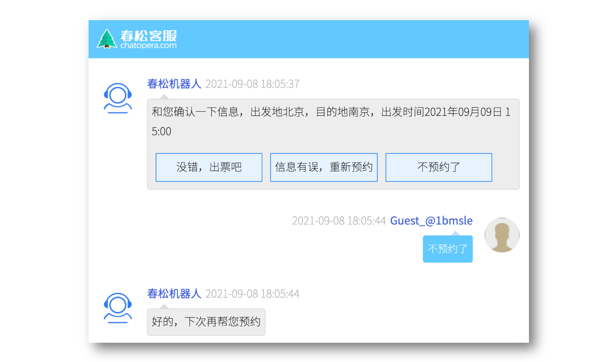
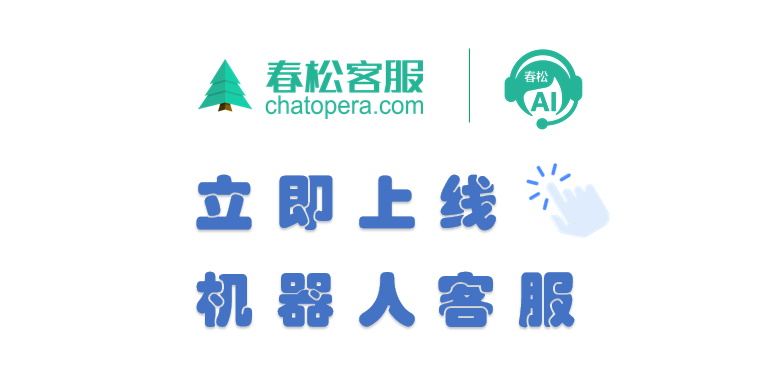
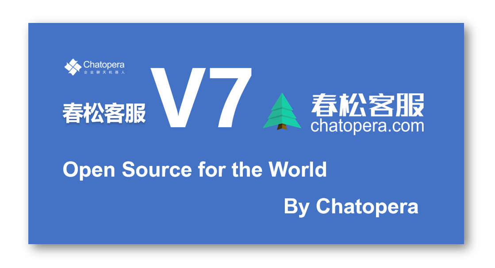

[主页](https://www.cskefu.com/)　|　[成功案例](#客户案例)　|　[开发者文档](https://docs.chatopera.com/products/cskefu/osc/index.html)　|　[博客专栏](https://chatopera.blog.csdn.net/)　|　[更新日志](./CHANGELOG.md)　|　[帮助](https://github.com/chatopera/cskefu/issues)

# 春松客服：做好开源客服系统

       <!-- ALL-CONTRIBUTORS-BADGE:START - Do not remove or modify this section -->

<!-- ALL-CONTRIBUTORS-BADGE:END -->

[https://www.cskefu.com](https://www.cskefu.com/) | [Github](https://github.com/chatopera/cskefu) | [Gitee](https://gitee.com/chatopera/cskefu) | [GitCode](https://gitcode.net/chatopera/cskefu)

:evergreen_tree: 春松客服是 [Chatopera](https://www.chatopera.com/) 发布的**开源并且免费**的智能客服系统 / CSKeFu is a Customer Support System for Enterprises in a High Performance Low-Touch way, OpenSource and Free for the world by [Chatopera](https://www.chatopera.com/).

在 Chatopera，我们相信：**越是重视客户服务，越是好的企业 / the more you care about your customers, the better income you earn in return**。

:hearts: 我们发布春松客服的愿景 / Our vision on CSKeFu:

- 做好开源客服系统 / Deliver Open Source Contact Center with High Quality
- 帮助企业快速获得开箱即用的免费智能客服系统 / Get Customer Support System in minutes
- 成为开发者首选的客服系统开发框架 / To be Top 1 Framework for Customer Support System Customization

:innocent: 我们对春松客服客户的承诺 / Our promise on CSKeFu:

- 我们不发布垃圾 / We don't ship junk
- 持续优化春松客服 / Keep on coming with great enhancements in the long term
- 坚持开源和免费，商业友好授权 / OpenSource for the world with license which is business friendly

  

其它播放地址：[微信公众号](https://mp.weixin.qq.com/s/ixFg3zVJP07e9EPQRPq2UQ) | [YouTube](https://youtu.be/ILf3BWpq4Ns)

新版本介绍：[一山还有一山高，开源智能客服系统春松客服 v7 版本发布 | Chatopera](https://chatopera.blog.csdn.net/article/details/113786505)

## 媒体报道

- [春松客服：通过开源加云原生模式，大规模交付智能客服系统](https://chatopera.blog.csdn.net/article/details/123599878)

- [春松客服荣获 GVP 企业级开源项目认证](http://www.ctiforum.com/news/guonei/578988.html)

- [春松客服：做好开源客服系统 | OpenTEKr 专访](https://www.bilibili.com/video/BV1qF411p7hW)

---

## 客户案例

  <b>:briefcase: TA 们都选择春松客服</b> 
  

## 产品演示

### 坐席工作台

[https://cc.chatopera.com/](https://cc.chatopera.com/)

| **登录账号** | **密码**  | **角色** |
| ------------ | --------- | --------- |
| admin        | admin1234 | 系统超级管理员 |
| zhangsan        | agent1234 | 客服坐席人员 |

### 网页端访客程序

[https://cc.chatopera.com/testclient.html](http://cc.chatopera.com/testclient.html)

- 登录张三后可接待访客，否则显示没有客服人员在线

### 机器人客服示例程序

[https://oh-my.cskefu.com/im/text/0nhckh.html](https://oh-my.cskefu.com/im/text/0nhckh.html)

## 功能介绍

### 免费模块

春松客服提供的开源代码，即[CSKeFu](https://github.com/chatopera/cskefu)，包含多个开箱即用的模块：

- 账号及组织机构管理：按组织、角色分配账号权限

- 访客渠道：支持 H5、PC 浏览器和[微信小程序原生](https://github.com/chatopera/cskefu-wxapp)；一分钟接入对话窗口，支持技能组、邀请和关联联系人等

- 联系人和客户管理：细粒度维护客户信息，自定义标签和打标签，记录来往历史等

- 坐席监控：设置坐席监控角色的人员可以看到并干预访客会话

- 坐席工作台：汇聚多渠道访客请求，坐席根据策略自动分配，自动弹屏，转接等

- 机器人客服：集成 [Chatopera 云服务](https://bot.chatopera.com)，利用 Chatopera 强大的聊天机器人解决方案，提升客户服务工作中的自动化、智能化；机器人客服插件既能通过知识库联想，知识库快捷支持坐席人员，也可以直接为访客提供查询、数据收集等功能；通过插件形式安装，插件也以开源形式提供，[查看插件源码](./public/plugins)。

- 企业聊天：支持企业员工在春松客服系统中群聊和私聊

- 质检：历史会话、服务小结、服务反馈及相关报表

### 付费模块

**春松客服从 v5.0.0 版本开始提供如下付费模块：**

- Messenger 渠道：在 Facebook 全家桶中连接亿万消费者、买家，视频简介 [Bilibili](https://www.bilibili.com/video/BV1Pa411t7jh) | [YouTube](https://www.youtube.com/watch?v=9EhkUU5yQig)，[详细介绍](https://docs.chatopera.com/products/cskefu/channels/messenger/index.html)。

付费模块代码并不开源，并且使用插件的形式安装在源码中，[请联系“商务洽谈”](https://www.chatopera.com/mail.html)获得插件和商业支持。

## 产品文档

关于产品的具体使用说明，请参考[文档中心](https://docs.chatopera.com/products/cskefu/index.html)。

### 产品截图

  <b>欢迎页</b> 
  

展开查看更多产品截图

  <b>坐席工作台</b> 
  

  <b>坐席监控</b> 
  

  <b>集成客服机器人</b> 
  

  <b>客服机器人应答</b> 
  

  <b>更多功能，敬请期待 ...</b> 
  

## 软件部署

### 私有部署

容器化一键部署，现在就使用春松客服！参考[《私有部署文档》](https://docs.chatopera.com/products/cskefu/deploy.html)。

### 容器云部署

容器云部署是云原生应用交付的最佳实践，简单易用。春松客服已经在以下容器云应用商店上架：

[Rainbond 云原生应用管理平台](https://www.rainbond.com/docs/opensource-app/chatopera/?channel=chatopera)：专注于以应用为中心的理念，赋能企业搭建云原生开发云、云原生交付云。

## 机器人客服

**超过 85% 的春松客服企业客户通过 Chatopera 云服务上线机器人客服！7x24 小时在线，接待访客，辅助人工坐席，提升 10 倍工作效率。**

Chatopera 机器人平台包括知识库、多轮对话、意图识别和语音识别等组件，标准化聊天机器人开发，支持企业 OA 智能问答、HR 智能问答、智能客服和网络营销等场景。企业 IT 部门、业务部门借助 Chatopera 云服务快速让聊天机器人上线！

### 机器人客服示例程序

[https://oh-my.cskefu.com/im/text/0nhckh.html](https://oh-my.cskefu.com/im/text/0nhckh.html)

### 立即上线机器人客服

上线机器人客服的两个方式：1）Chatopera 云服务，按量付费，提供每日免费额度；2）私有部署。

查看文档[《立即上线机器人客服》](https://docs.chatopera.com/products/cskefu/work-chatbot/bot-agent.html)。

  

展开查看 Chatopera 云服务的产品截图

  <b>自定义词典</b> 
  

  <b>自定义词条</b> 
  

  <b>创建意图</b> 
  

  <b>添加说法和槽位</b> 
  

  <b>训练模型</b> 
  

  <b>测试对话</b> 
  

  <b>机器人画像</b> 
  

  <b>系统集成</b> 
  

  <b>聊天历史</b> 
  

## 开发者社区

### 贡献者列表 ✨

Thanks goes to these wonderful people ([emoji key](https://allcontributors.org/docs/en/emoji-key)):

<!-- ALL-CONTRIBUTORS-LIST:START - Do not remove or modify this section -->
<!-- prettier-ignore-start -->
<!-- markdownlint-disable -->
<table>
  <tr>
    <td align="center"><a href="https://github.com/mukaiu"> <b>Mukaiu</b></a> <a href="https://github.com/chatopera/cskefu/commits?author=mukaiu" title="Code">💻</a></td>
    <td align="center"><a href="https://www.linkedin.com/in/hai-liang-wang/"> <b>Hai Liang Wang</b></a> <a href="https://github.com/chatopera/cskefu/commits?author=hailiang-wang" title="Code">💻</a></td>
    <td align="center"><a href="https://github.com/shih945"> <b>SHIH</b></a> <a href="https://github.com/chatopera/cskefu/commits?author=shih945" title="Code">💻</a></td>
    <td align="center"><a href="https://github.com/luruiGit"> <b>luruiGit</b></a> <a href="https://github.com/chatopera/cskefu/commits?author=luruiGit" title="Code">💻</a></td>
    <td align="center"><a href="http://enze5088.github.io"> <b>Enze</b></a> <a href="https://github.com/chatopera/cskefu/commits?author=enze5088" title="Code">💻</a></td>
    <td align="center"><a href="https://blog.dengchao.fun"> <b>邓超</b></a> <a href="https://github.com/chatopera/cskefu/commits?author=DevDengChao" title="Code">💻</a></td>
    <td align="center"><a href="https://github.com/Happy5"> <b>Happy5</b></a> <a href="#ideas-Happy5" title="Ideas, Planning, & Feedback">🤔</a></td>
  </tr>
  <tr>
    <td align="center"><a href="https://www.csdn.net"> <b>kyle</b></a> <a href="https://github.com/chatopera/cskefu/commits?author=kylezhang" title="Code">💻</a></td>
    <td align="center"><a href="https://github.com/xianliwang"> <b>xianliwang</b></a> <a href="#video-xianliwang" title="Videos">📹</a> <a href="https://github.com/chatopera/cskefu/commits?author=xianliwang" title="Tests">⚠️</a></td>
    <td align="center"><a href="https://github.com/lihang2016"> <b>lihang2016</b></a> <a href="#ideas-lihang2016" title="Ideas, Planning, & Feedback">🤔</a></td>
    <td align="center"><a href="https://github.com/live-in-the-moment"> <b>live-in-the-moment</b></a> <a href="#ideas-live-in-the-moment" title="Ideas, Planning, & Feedback">🤔</a></td>
    <td align="center"><a href="https://github.com/ArioWei"> <b>ArioWei</b></a> <a href="https://github.com/chatopera/cskefu/commits?author=ArioWei" title="Tests">⚠️</a></td>
    <td align="center"><a href="http://www.youkefu.cn"> <b>优客服</b></a> <a href="https://github.com/chatopera/cskefu/commits?author=youkefu" title="Code">💻</a> <a href="https://github.com/chatopera/cskefu/commits?author=youkefu" title="Tests">⚠️</a> <a href="#business-youkefu" title="Business development">💼</a> <a href="#design-youkefu" title="Design">🎨</a></td>
    <td align="center"><a href="https://github.com/lecjy"> <b>lecjy</b></a> <a href="#ideas-lecjy" title="Ideas, Planning, & Feedback">🤔</a> <a href="#talk-lecjy" title="Talks">📢</a></td>
  </tr>
  <tr>
    <td align="center"><a href="https://github.com/xl111"> <b>徐。。</b></a> <a href="https://github.com/chatopera/cskefu/commits?author=xl111" title="Code">💻</a></td>
    <td align="center"><a href="https://github.com/viaco2ove"> <b>viaco2ove</b></a> <a href="https://github.com/chatopera/cskefu/commits?author=viaco2ove" title="Code">💻</a></td>
    <td align="center"><a href="https://github.com/understanding"> <b>understanding</b></a> <a href="https://github.com/chatopera/cskefu/commits?author=understanding" title="Tests">⚠️</a></td>
  </tr>
</table>

<!-- markdownlint-restore -->
<!-- prettier-ignore-end -->

<!-- ALL-CONTRIBUTORS-LIST:END -->

### 用户交流群

  <b>在 Chatopera 客户群中也包括其他用户，请不要发送敏感信息。讨论与 Chatopera 产品和服务相关的事宜</b> 

更多开发者社区介绍，查看：[https://docs.chatopera.com/products/cskefu/osc/index.html](https://docs.chatopera.com/products/cskefu/osc/index.html)

### 社区协作

关于软件使用的任何问题，先开工单 -

- [Help: 开发环境搭建、功能咨询和使用问题等](https://github.com/chatopera/cskefu/issues/new?assignees=hailiang-wang&labels=help-wanted&template=1_help.md&title=Title%3A+%E7%94%A8%E4%B8%80%E5%8F%A5%E8%AF%9D%E9%99%88%E8%BF%B0%E4%BA%8B%E6%83%85%EF%BC%8C%E4%BF%9D%E8%AF%81%E8%A8%80%E7%AE%80%E6%84%8F%E8%B5%85%EF%BC%8C%E6%AF%94%E5%A6%82%E9%97%AE%E9%A2%98%E7%AE%80%E8%BF%B0%E5%8F%8A+root+cause+%E6%97%A5%E5%BF%97%E8%AF%AD%E5%8F%A5%EF%BC%8C%E6%9B%B4%E5%AE%B9%E6%98%93%E8%8E%B7%E5%BE%97%E5%B8%AE%E5%8A%A9)
- [Bug: 提交软件缺陷](https://github.com/chatopera/cskefu/issues/new?assignees=hailiang-wang&labels=bug&template=2_bug_report.md&title=Title%3A+%E7%94%A8%E4%B8%80%E5%8F%A5%E8%AF%9D%E9%99%88%E8%BF%B0%E4%BA%8B%E6%83%85%EF%BC%8C%E4%BF%9D%E8%AF%81%E8%A8%80%E7%AE%80%E6%84%8F%E8%B5%85%EF%BC%8C%E6%AF%94%E5%A6%82%E9%97%AE%E9%A2%98%E7%AE%80%E8%BF%B0%E5%8F%8A+root+cause+%E6%97%A5%E5%BF%97%E8%AF%AD%E5%8F%A5%EF%BC%8C%E6%9B%B4%E5%AE%B9%E6%98%93%E8%8E%B7%E5%BE%97%E5%B8%AE%E5%8A%A9)
- [Requirement: 描述新需求、反馈建议](https://github.com/chatopera/cskefu/issues/new?assignees=hailiang-wang&labels=requirement&template=3_requirement.md&title=Title%3A+%E7%94%A8%E4%B8%80%E5%8F%A5%E8%AF%9D%E9%99%88%E8%BF%B0%E4%BA%8B%E6%83%85%EF%BC%8C%E4%BF%9D%E8%AF%81%E8%A8%80%E7%AE%80%E6%84%8F%E8%B5%85%EF%BC%8C%E6%AF%94%E5%A6%82%E9%97%AE%E9%A2%98%E7%AE%80%E8%BF%B0%E5%8F%8A+root+cause+%E6%97%A5%E5%BF%97%E8%AF%AD%E5%8F%A5%EF%BC%8C%E6%9B%B4%E5%AE%B9%E6%98%93%E8%8E%B7%E5%BE%97%E5%B8%AE%E5%8A%A9)
- [Profiling: 瓶颈分析、性能优化建议和安全漏洞等](https://github.com/chatopera/cskefu/issues/new?assignees=hailiang-wang&labels=profiling&template=4_profiling.md&title=Title%3A+%E7%94%A8%E4%B8%80%E5%8F%A5%E8%AF%9D%E9%99%88%E8%BF%B0%E4%BA%8B%E6%83%85%EF%BC%8C%E4%BF%9D%E8%AF%81%E8%A8%80%E7%AE%80%E6%84%8F%E8%B5%85%EF%BC%8C%E6%AF%94%E5%A6%82%E9%97%AE%E9%A2%98%E7%AE%80%E8%BF%B0%E5%8F%8A+root+cause+%E6%97%A5%E5%BF%97%E8%AF%AD%E5%8F%A5%EF%BC%8C%E6%9B%B4%E5%AE%B9%E6%98%93%E8%8E%B7%E5%BE%97%E5%B8%AE%E5%8A%A9)

### 在线培训视频

《春松客服大讲堂 2019》课程有发布到两个地址：Bilibili 和 [腾讯课堂](https://ke.qq.com/course/464050)。Bilibili 视频免费观看，腾讯课堂为付费，有条件的观众请在腾讯课堂购买，以示对我们工作的支持和鼓励 :heartpulse:，做好开源客服系统。

以下列表中使用 Bilibili 站点地址，PPT 课件库地址 [chatopera/cskefu.djt](https://github.com/chatopera/cskefu.djt)。

<table>
  <tr>
    <th>章</th>
    <th>小节</th>
    <th>时长（时:分:秒）</th>
    <th>课件</th>
  </tr>
  <tr>
    <td rowspan="3">一、春松客服的介绍</td>
    <td><a href="https://www.bilibili.com/video/BV13P4y1V7Jk?p=1">如何使用Java开发智能客服系统</a></td>
    <td>00:32:11</td>
    <td><a href="https://github.com/chatopera/cskefu.djt/raw/main/%E6%98%A5%E6%9D%BE%E5%AE%A2%E6%9C%8D%E5%A4%A7%E8%AE%B2%E5%A0%82_2019/1-1.opencc-in-java.pptx">PPT</a></td>
  </tr>
  <tr>
    <td><a href="https://www.bilibili.com/video/BV13P4y1V7Jk?p=2">春松客服在企业的落地</a></td>
    <td>00:30:41</td>
    <td><a href="https://github.com/chatopera/cskefu.djt/raw/main/%E6%98%A5%E6%9D%BE%E5%AE%A2%E6%9C%8D%E5%A4%A7%E8%AE%B2%E5%A0%82_2019/1-2.quickview-of-cc.pptx">PPT</a></td>
  </tr>
  <tr>
    <td><a href="https://www.bilibili.com/video/BV13P4y1V7Jk?p=3">春松客服的技术介绍</a></td>
    <td>01:09:30</td>
    <td><a href="https://github.com/chatopera/cskefu.djt/raw/main/%E6%98%A5%E6%9D%BE%E5%AE%A2%E6%9C%8D%E5%A4%A7%E8%AE%B2%E5%A0%82_2019/1-3.technologies-overview.pptx">PPT</a></td>
  </tr>
  <tr>
    <td rowspan="7">二、客服相关的基本知识</td>
    <td><a href="https://www.bilibili.com/video/BV1Qr4y1k772?p=1">客服的日常工作</a></td>
    <td>00:57:35</td>
    <td><a href="https://github.com/chatopera/cskefu.djt/raw/main/%E6%98%A5%E6%9D%BE%E5%AE%A2%E6%9C%8D%E5%A4%A7%E8%AE%B2%E5%A0%82_2019/2-1.kefu-daily-job.pptx">PPT</a></td>
  </tr>
  <tr>
    <td><a href="https://www.bilibili.com/video/BV1Qr4y1k772?p=2">客服的基本知识</a></td>
    <td>00:46:48</td>
    <td><a href="https://github.com/chatopera/cskefu.djt/raw/main/%E6%98%A5%E6%9D%BE%E5%AE%A2%E6%9C%8D%E5%A4%A7%E8%AE%B2%E5%A0%82_2019/2-2.kefu-fundamentals.pptx">PPT</a></td>
  </tr>
  <tr>
    <td><a href="https://www.bilibili.com/video/BV1Qr4y1k772?p=3">账号体系-权限，部门和角色</a></td>
    <td>00:42:06</td>
    <td><a href="https://github.com/chatopera/cskefu.djt/raw/main/%E6%98%A5%E6%9D%BE%E5%AE%A2%E6%9C%8D%E5%A4%A7%E8%AE%B2%E5%A0%82_2019/2-3.accout-n-permissions.pptx">PPT</a></td>
  </tr>
  <tr>
    <td><a href="https://www.bilibili.com/video/BV1Qr4y1k772?p=4">坐席会话的工具-拉黑，服务小结和转接</a></td>
    <td>00:33:00</td>
    <td><a href="https://github.com/chatopera/cskefu.djt/raw/main/%E6%98%A5%E6%9D%BE%E5%AE%A2%E6%9C%8D%E5%A4%A7%E8%AE%B2%E5%A0%82_2019/2-4.agent-toolset.pptx">PPT</a></td>
  </tr>
  <tr>
    <td><a href="https://www.bilibili.com/video/BV1Qr4y1k772?p=5">即时通信及坐席自动分配</a></td>
    <td>00:56:50</td>
    <td><a href="https://github.com/chatopera/cskefu.djt/raw/main/%E6%98%A5%E6%9D%BE%E5%AE%A2%E6%9C%8D%E5%A4%A7%E8%AE%B2%E5%A0%82_2019/2-5.instant-messaging.pptx">PPT</a></td>
  </tr>
  <tr>
    <td><a href="https://www.bilibili.com/video/BV1Qr4y1k772?p=6">企业聊天与人工质检</a></td>
    <td>00:35:12</td>
    <td><a href="https://github.com/chatopera/cskefu.djt/raw/main/%E6%98%A5%E6%9D%BE%E5%AE%A2%E6%9C%8D%E5%A4%A7%E8%AE%B2%E5%A0%82_2019/4-3.entim-and-quality-inspection.pptx">PPT</a></td>
  </tr>
  <tr>
    <td><a href="https://www.bilibili.com/video/BV1Qr4y1k772?p=7">统计报表和满意度评价</a></td>
    <td>00:37:18</td>
    <td><a href="https://github.com/chatopera/cskefu.djt/raw/main/%E6%98%A5%E6%9D%BE%E5%AE%A2%E6%9C%8D%E5%A4%A7%E8%AE%B2%E5%A0%82_2019/2-5.instant-messaging.pptx">PPT</a></td>
  </tr>
  <tr>
    <td rowspan="6">三、春松客服的上线及维护</td>
    <td><a href="https://www.bilibili.com/video/BV14M4y1P77U?p=1">春松客服的编译和部署</a></td>
    <td>00:38:27</td>
    <td><a href="https://github.com/chatopera/cskefu.djt/raw/main/%E6%98%A5%E6%9D%BE%E5%AE%A2%E6%9C%8D%E5%A4%A7%E8%AE%B2%E5%A0%82_2019/3-1.cskefu-compile-deploy.pptx">PPT</a></td>
  </tr>
  <tr>
    <td><a href="https://www.bilibili.com/video/BV14M4y1P77U?p=2">春松客服的运维管理</a></td>
    <td>01:00:37</td>
    <td><a href="https://github.com/chatopera/cskefu.djt/raw/main/%E6%98%A5%E6%9D%BE%E5%AE%A2%E6%9C%8D%E5%A4%A7%E8%AE%B2%E5%A0%82_2019/3-2.cskefu-maintenance.pptx">PPT</a></td>
  </tr>
  <tr>
    <td><a href="https://www.bilibili.com/video/BV14M4y1P77U?p=3">春松客服的自动化系统测试（1）</a></td>
    <td>00:32:45</td>
    <td><a href="https://github.com/chatopera/cskefu.djt/raw/main/%E6%98%A5%E6%9D%BE%E5%AE%A2%E6%9C%8D%E5%A4%A7%E8%AE%B2%E5%A0%82_2019/4-1.automatic-system-test.pptx">PPT</a></td>
  </tr>
  <tr>
    <td><a href="https://www.bilibili.com/video/BV14M4y1P77U?p=4">春松客服的自动化系统测试（2）</a></td>
    <td>00:49:20</td>
    <td><a href="https://github.com/chatopera/cskefu.djt/raw/main/%E6%98%A5%E6%9D%BE%E5%AE%A2%E6%9C%8D%E5%A4%A7%E8%AE%B2%E5%A0%82_2019/4-1.automatic-system-test.pptx">PPT</a></td>
  </tr>
  <tr>
    <td><a href="https://www.bilibili.com/video/BV14M4y1P77U?p=5">春松客服的压力测试（1）</a></td>
    <td>00:42:33</td>
    <td><a href="https://github.com/chatopera/cskefu.djt/raw/main/%E6%98%A5%E6%9D%BE%E5%AE%A2%E6%9C%8D%E5%A4%A7%E8%AE%B2%E5%A0%82_2019/4-2.stress-test.pptx">PPT</a></td>
  </tr>
  <tr>
    <td><a href="https://www.bilibili.com/video/BV14M4y1P77U?p=6">春松客服的压力测试（2）</a></td>
    <td>00:40:39</td>
    <td><a href="https://github.com/chatopera/cskefu.djt/raw/main/%E6%98%A5%E6%9D%BE%E5%AE%A2%E6%9C%8D%E5%A4%A7%E8%AE%B2%E5%A0%82_2019/4-2.stress-test.pptx">PPT</a></td>
  </tr>
  <tr>
    <td rowspan="3">四、春松客服的机器人客服</td>
    <td><a href="https://www.bilibili.com/video/BV1s44y1Y7mV?p=1">Chatopera 云服务介绍</a></td>
    <td>00:28:01</td>
    <td><a href="https://github.com/chatopera/cskefu.djt/raw/main/%E6%98%A5%E6%9D%BE%E5%AE%A2%E6%9C%8D%E5%A4%A7%E8%AE%B2%E5%A0%82_2019/6-1.chatopera-botcloud.pptx">PPT</a></td>
  </tr>
  <tr>
    <td><a href="https://www.bilibili.com/video/BV1s44y1Y7mV?p=2">机器人的知识库管理</a></td>
    <td>00:47:56</td>
    <td><a href="https://github.com/chatopera/cskefu.djt/raw/main/%E6%98%A5%E6%9D%BE%E5%AE%A2%E6%9C%8D%E5%A4%A7%E8%AE%B2%E5%A0%82_2019/6-1.chatopera-botcloud.pptx">PPT</a></td>
  </tr>
  <tr>
    <td><a href="https://www.bilibili.com/video/BV1s44y1Y7mV?p=3">机器人的多轮对话及富文本消息类型</a></td>
    <td>00:43:32</td>
    <td><a href="https://github.com/chatopera/cskefu.djt/raw/main/%E6%98%A5%E6%9D%BE%E5%AE%A2%E6%9C%8D%E5%A4%A7%E8%AE%B2%E5%A0%82_2019/6-1.chatopera-botcloud.pptx">PPT</a></td>
  </tr>
  <tr>
    <td rowspan="8">五、春松客服开发基础知识</td>
    <td><a href="https://www.bilibili.com/video/BV1ah411s7ak?p=1">SQL快速入门</a></td>
    <td>00:46:39</td>
    <td><a href="https://github.com/chatopera/cskefu.djt/raw/main/%E6%98%A5%E6%9D%BE%E5%AE%A2%E6%9C%8D%E5%A4%A7%E8%AE%B2%E5%A0%82_2019/5-1.sql-basics.pptx">PPT</a></td>
  </tr>
  <tr>
    <td><a href="https://www.bilibili.com/video/BV1ah411s7ak?p=2">春松客服数据库表及管理</a></td>
    <td>00:45:30</td>
    <td><a href="https://github.com/chatopera/cskefu.djt/raw/main/%E6%98%A5%E6%9D%BE%E5%AE%A2%E6%9C%8D%E5%A4%A7%E8%AE%B2%E5%A0%82_2019/5-2.java-basics.pptx">PPT</a></td>
  </tr>
  <tr>
    <td><a href="https://www.bilibili.com/video/BV1ah411s7ak?p=3">Java编程基础（1）</a></td>
    <td>00:45:24</td>
    <td><a href="https://github.com/chatopera/cskefu.djt/raw/main/%E6%98%A5%E6%9D%BE%E5%AE%A2%E6%9C%8D%E5%A4%A7%E8%AE%B2%E5%A0%82_2019/5-2.java-basics.pptx">PPT</a></td>
  </tr>
  <tr>
    <td><a href="https://www.bilibili.com/video/BV1ah411s7ak?p=4">Java编程基础（2）</a></td>
    <td>01:37:53</td>
    <td><a href="https://github.com/chatopera/cskefu.djt/raw/main/%E6%98%A5%E6%9D%BE%E5%AE%A2%E6%9C%8D%E5%A4%A7%E8%AE%B2%E5%A0%82_2019/5-2.java-basics.pptx">PPT</a></td>
  </tr>
  <tr>
    <td><a href="https://www.bilibili.com/video/BV1ah411s7ak?p=5">Maven项目管理</a></td>
    <td>00:46:18</td>
    <td><a href="https://github.com/chatopera/cskefu.djt/raw/main/%E6%98%A5%E6%9D%BE%E5%AE%A2%E6%9C%8D%E5%A4%A7%E8%AE%B2%E5%A0%82_2019/5-3.maven-idea.pptx">PPT</a></td>
  </tr>
  <tr>
    <td><a href="https://www.bilibili.com/video/BV1ah411s7ak?p=6">搭建春松客服开发环境</a></td>
    <td>01:10:28</td>
    <td><a href="https://github.com/chatopera/cskefu.djt/raw/main/%E6%98%A5%E6%9D%BE%E5%AE%A2%E6%9C%8D%E5%A4%A7%E8%AE%B2%E5%A0%82_2019/5-3.maven-idea.pptx">PPT</a></td>
  </tr>
  <tr>
    <td><a href="https://www.bilibili.com/video/BV1ah411s7ak?p=7">SpringBoot快速入门</a></td>
    <td>00:45:50</td>
    <td><a href="https://github.com/chatopera/cskefu.djt/raw/main/%E6%98%A5%E6%9D%BE%E5%AE%A2%E6%9C%8D%E5%A4%A7%E8%AE%B2%E5%A0%82_2019/5-3.maven-idea.pptx">PPT</a></td>
  </tr>
  <tr>
    <td><a href="https://www.bilibili.com/video/BV1ah411s7ak?p=8">项目源码讲解</a></td>
    <td>01:09:40</td>
    <td><a href="https://github.com/chatopera/cskefu.djt/raw/main/%E6%98%A5%E6%9D%BE%E5%AE%A2%E6%9C%8D%E5%A4%A7%E8%AE%B2%E5%A0%82_2019/7-1.sourcecode-deepdive.pptx">PPT</a></td>
  </tr>
  <tr>
    <td rowspan="2">六、春松客服的插件</td>
    <td><a href="https://www.bilibili.com/video/BV1Mr4y1Q7hc?p=1">插件机制设计</a></td>
    <td>00:45:51</td>
    <td><a href="https://github.com/chatopera/cskefu.djt/raw/main/%E6%98%A5%E6%9D%BE%E5%AE%A2%E6%9C%8D%E5%A4%A7%E8%AE%B2%E5%A0%82_2019/7-2.plugin-mechanism-chatbot.pptx">PPT</a></td>
  </tr>
  <tr>
    <td><a href="https://www.bilibili.com/video/BV1Mr4y1Q7hc?p=2">春松客服机器人插件解读</a></td>
    <td>00:41:20</td>
    <td><a href="https://github.com/chatopera/cskefu.djt/raw/main/%E6%98%A5%E6%9D%BE%E5%AE%A2%E6%9C%8D%E5%A4%A7%E8%AE%B2%E5%A0%82_2019/7-2.plugin-mechanism-chatbot.pptx">PPT</a></td>
  </tr>
  <tr>
    <td>七、总结</td>
    <td><a href="https://www.bilibili.com/video/BV1RL411M7Zr">春松客服团队介绍及课程总结</a></td>
    <td>00:32:11</td>
    <td><a href="https://github.com/chatopera/cskefu.djt/raw/main/%E6%98%A5%E6%9D%BE%E5%AE%A2%E6%9C%8D%E5%A4%A7%E8%AE%B2%E5%A0%82_2019/8-1.course-summary.pptx">PPT</a></td>
  </tr>
</table>

### 开发者文档

  <b><a href="https://docs.chatopera.com/products/cskefu/osc/engineering.html" target="_blank">开发者文档</a></b> 
  

## 鸣谢

[IBM Cloud 赞助春松客服服务器资源 12W US Dollar（2019 年度）](https://cloud.ibm.com/)

[Amazon AWS 赞助春松客服服务器资源 5W RMB（2021 年度）](https://aws.amazon.com)

## 开源许可协议

Copyright (2018-2022) <a href="https://www.chatopera.com/" target="_blank">北京华夏春松科技有限公司</a>

[Apache License Version 2.0](https://github.com/chatopera/cskefu/blob/osc/LICENSE)

