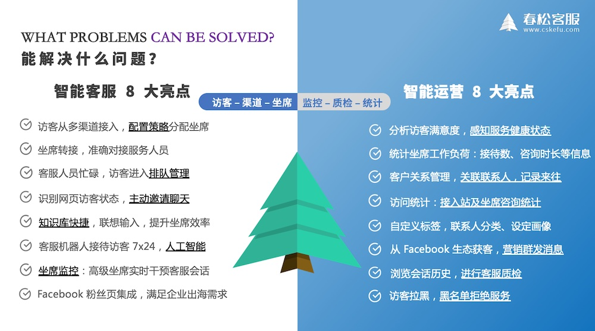
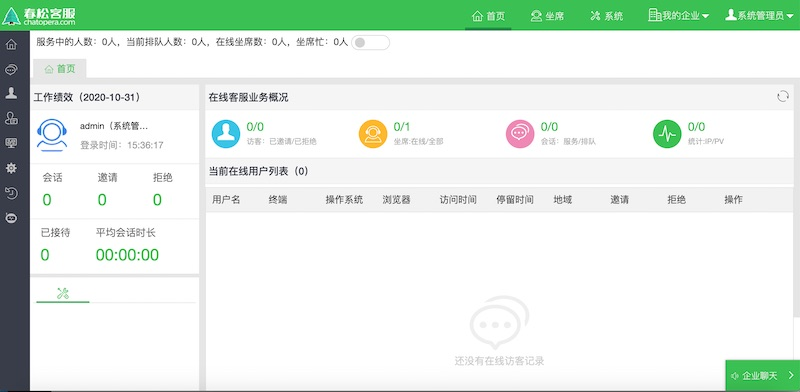
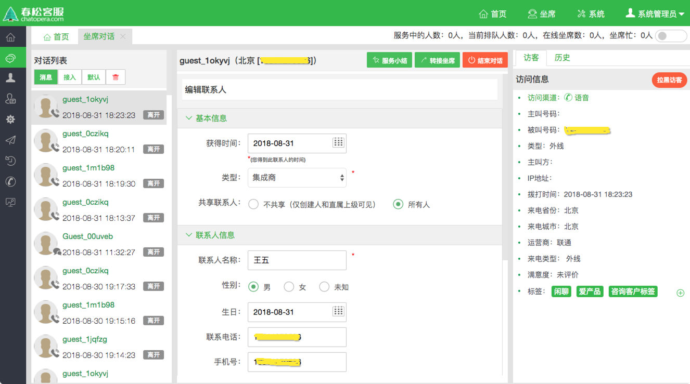
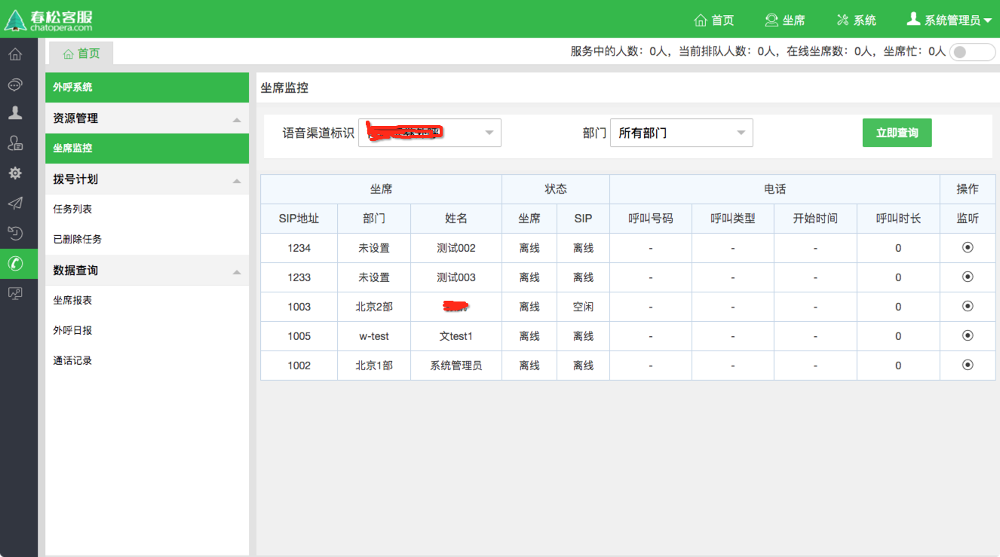
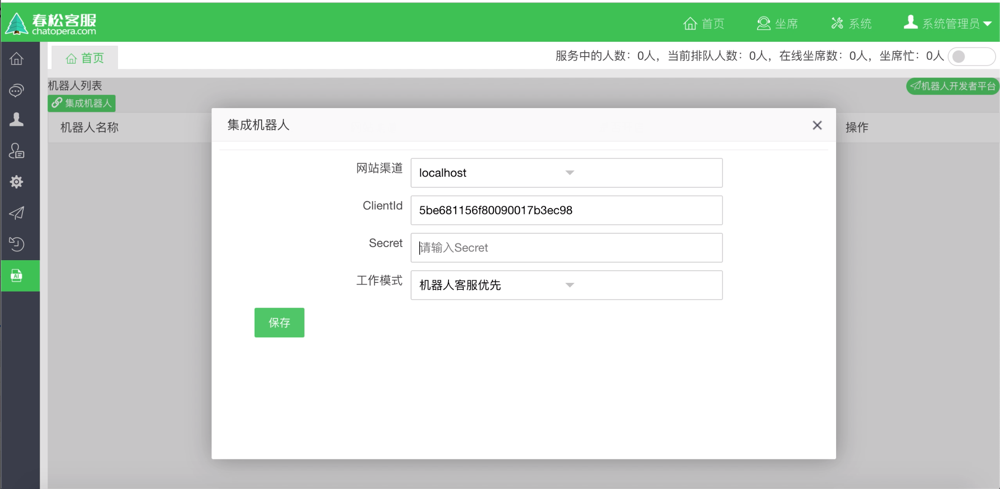
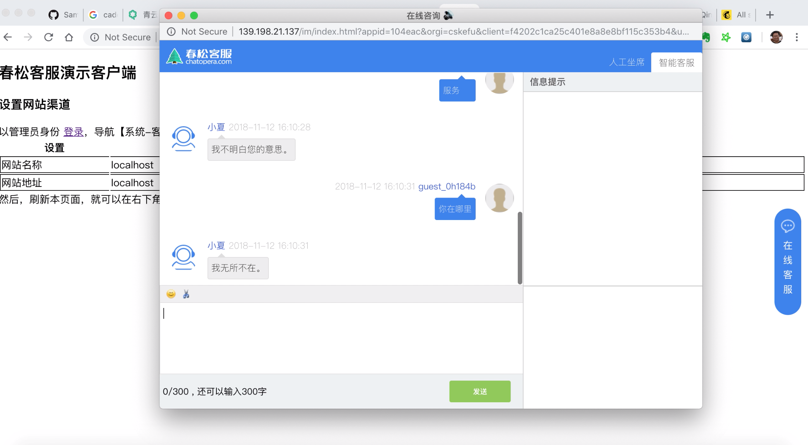
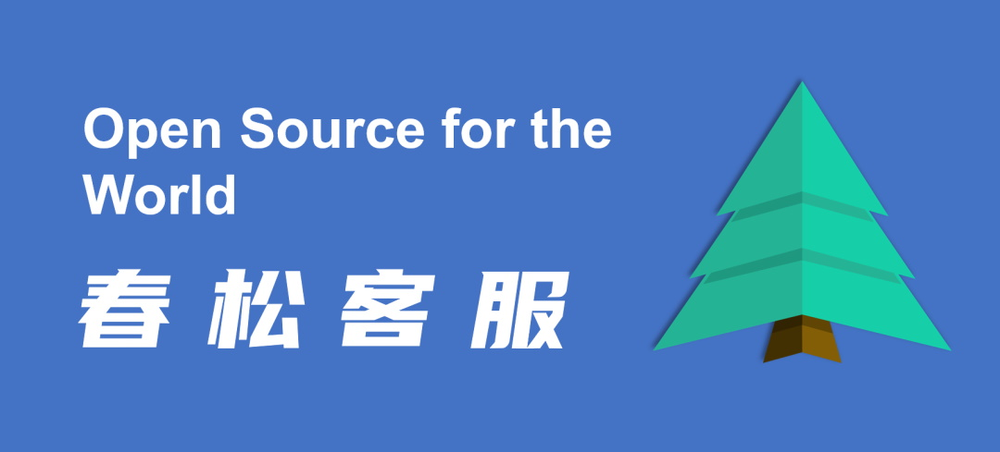

[产品形式及授权](https://docs.cskefu.com/docs/licenses)　|　[开源版许可证](https://docs.cskefu.com/licenses/v1.html)　|　[开源社区工单](https://github.com/cskefu/cskefu/issues)　|　[官网](https://www.cskefu.com/)

# 春松客服

春松客服是一个企业客服系统解决方案，通过模块化完成企业客户服务工作的运营，包括座席工作台、联系人管理、访客渠道和会话管理等。

目前，春松客服包括两个产品和服务模式：

| 模式 | EE / 企业版 | OSS / 开源版 |
| --- | --- | --- |
| 是否开源 | 否 | 是 |
| 收费模式 | 根据服务项目进行[商业洽谈](https://www.chatopera.com/mail.html) | 启动服务后导入[授权证书](https://store.chatopera.com/product/cskefu001) |  
| 软件迭代 | 官方团队迭代开发 | 通过[开源社区](https://www.cskefu.com/)形式 |
| 源码许可证 | 闭源，购买后提供下载地址，可任意修改、销售 | [源码地址](https://github.com/cskefu/cskefu)，[春松许可证, v1.0](https://docs.cskefu.com/docs/osc/license) |
| 技术支持 | 官方技术团队商业支持 | 通过开源社区[提交工单](https://github.com/cskefu/cskefu/issues) | 
| 部署及运维 | 官方技术团队商业支持 | 根据开源社区文档，[文档中心](https://docs.cskefu.com/docs/) |
| 使用培训 | 客服系统及二次开发的培训由官方团队支持 | 购买[春松客服大讲堂](https://docs.cskefu.com/docs/osc/training) |

# 春松客服 OSS 开源版

      <!-- ALL-CONTRIBUTORS-BADGE:START - Do not remove or modify this section -->

<!-- ALL-CONTRIBUTORS-BADGE:END -->

[https://www.cskefu.com](https://www.cskefu.com/)

| 版本 | 文档中心 | Git 分支 | 状态 |
| --- | --- | --- | --- |
| v8.x | [v8](https://docs.cskefu.com/docs/) |  [GitHub](https://github.com/cskefu/cskefu/tree/develop) \| [Gitee](https://gitee.com/cskefu/cskefu/tree/develop/) | Active, 维护中 |
| v7.x | [v7](https://docs.cskefu.com/docs/v7/) |  [GitHub](https://github.com/cskefu/cskefu/tree/v7) \| [Gitee](https://gitee.com/cskefu/cskefu/tree/v7/) | Sunset, 维护终止 |

:hearts: 春松客服的愿景：

- 公元 2032 年内，1000 万企业上线开源客服系统

:innocent: 春松客服的承诺:

- 坚持基础功能开源，不发布垃圾
- 坚持持续优化
- 坚持商业友好授权

春松客服宣言视频： [Bilibili](https://www.bilibili.com/video/BV1hu411o76r/) | [YouTube](https://youtu.be/ILf3BWpq4Ns)

新版本介绍：[观看春松客服 v8 新版本发布会 @ 2023-07-01](https://www.cskefu.com/2023/07/03/community-conf/)

## 开发者列表 ✨

:evergreen_tree: 春松客服是开源的智能客服系统，于 2018 年 9 月由 [Chatopera](https://www.chatopera.com) 发布，在开源社区协作中优化和完善，春松客服属于[春松客服开源社区](https://github.com/cskefu/cskefu#%E6%98%A5%E6%9D%BE%E5%AE%A2%E6%9C%8D%E5%BC%80%E6%BA%90%E7%A4%BE%E5%8C%BA)。

<!-- ALL-CONTRIBUTORS-LIST:START - Do not remove or modify this section -->
<!-- prettier-ignore-start -->
<!-- markdownlint-disable -->
<table>
  <tbody>
    <tr>
      <td align="center" valign="top" width="11.11%"><a href="https://github.com/mukaiu"> <b>Mukaiu</b></a> <a href="https://github.com/cskefu/cskefu/commits?author=mukaiu" title="Code">💻</a> <a href="#infra-mukaiu" title="Infrastructure (Hosting, Build-Tools, etc)">🚇</a></td>
      <td align="center" valign="top" width="11.11%"><a href="https://www.linkedin.com/in/hai-liang-wang/"> <b>Hai Liang W.</b></a> <a href="#plugin-hailiang-wang" title="Plugin/utility libraries">🔌</a> <a href="#financial-hailiang-wang" title="Financial">💵</a></td>
      <td align="center" valign="top" width="11.11%"><a href="https://github.com/shih945"> <b>SHIH</b></a> <a href="https://github.com/cskefu/cskefu/commits?author=shih945" title="Code">💻</a></td>
      <td align="center" valign="top" width="11.11%"><a href="https://github.com/luruiGit"> <b>luruiGit</b></a> <a href="https://github.com/cskefu/cskefu/commits?author=luruiGit" title="Code">💻</a></td>
      <td align="center" valign="top" width="11.11%"><a href="http://enze5088.github.io"> <b>Enze</b></a> <a href="https://github.com/cskefu/cskefu/commits?author=enze5088" title="Code">💻</a></td>
      <td align="center" valign="top" width="11.11%"><a href="https://blog.dengchao.fun"> <b>邓超</b></a> <a href="https://github.com/cskefu/cskefu/commits?author=DevDengChao" title="Code">💻</a></td>
      <td align="center" valign="top" width="11.11%"><a href="https://github.com/Happy5"> <b>Happy5</b></a> <a href="#ideas-Happy5" title="Ideas, Planning, & Feedback">🤔</a></td>
      <td align="center" valign="top" width="11.11%"><a href="https://www.csdn.net"> <b>kyle</b></a> <a href="https://github.com/cskefu/cskefu/commits?author=kylezhang" title="Code">💻</a> <a href="#talk-kylezhang" title="Talks">📢</a></td>
      <td align="center" valign="top" width="11.11%"><a href="https://github.com/xianliwang"> <b>xianliwang</b></a> <a href="#video-xianliwang" title="Videos">📹</a> <a href="https://github.com/cskefu/cskefu/commits?author=xianliwang" title="Tests">⚠️</a></td>
    </tr>
    <tr>
      <td align="center" valign="top" width="11.11%"><a href="https://github.com/lihang2016"> <b>lihang2016</b></a> <a href="#ideas-lihang2016" title="Ideas, Planning, & Feedback">🤔</a></td>
      <td align="center" valign="top" width="11.11%"><a href="https://github.com/live-in-the-moment"> <b>live-in-the-moment</b></a> <a href="#ideas-live-in-the-moment" title="Ideas, Planning, & Feedback">🤔</a> <a href="https://github.com/cskefu/cskefu/issues?q=author%3Alive-in-the-moment" title="Bug reports">🐛</a> <a href="https://github.com/cskefu/cskefu/commits?author=live-in-the-moment" title="Tests">⚠️</a></td>
      <td align="center" valign="top" width="11.11%"><a href="https://github.com/ArioWei"> <b>ArioWei</b></a> <a href="https://github.com/cskefu/cskefu/commits?author=ArioWei" title="Tests">⚠️</a></td>
      <td align="center" valign="top" width="11.11%"><a href="http://www.youkefu.cn"> <b>优客服</b></a> <a href="https://github.com/cskefu/cskefu/commits?author=youkefu" title="Code">💻</a> <a href="https://github.com/cskefu/cskefu/commits?author=youkefu" title="Tests">⚠️</a> <a href="#business-youkefu" title="Business development">💼</a> <a href="#design-youkefu" title="Design">🎨</a></td>
      <td align="center" valign="top" width="11.11%"><a href="https://github.com/lecjy"> <b>lecjy</b></a> <a href="#ideas-lecjy" title="Ideas, Planning, & Feedback">🤔</a> <a href="#talk-lecjy" title="Talks">📢</a> <a href="#mentoring-lecjy" title="Mentoring">🧑‍🏫</a> <a href="#maintenance-lecjy" title="Maintenance">🚧</a> <a href="https://github.com/cskefu/cskefu/commits?author=lecjy" title="Code">💻</a></td>
      <td align="center" valign="top" width="11.11%"><a href="https://github.com/xl111"> <b>徐。。</b></a> <a href="https://github.com/cskefu/cskefu/commits?author=xl111" title="Code">💻</a></td>
      <td align="center" valign="top" width="11.11%"><a href="https://github.com/viaco2ove"> <b>viaco2ove</b></a> <a href="https://github.com/cskefu/cskefu/commits?author=viaco2ove" title="Code">💻</a></td>
      <td align="center" valign="top" width="11.11%"><a href="https://github.com/understanding"> <b>understanding</b></a> <a href="https://github.com/cskefu/cskefu/commits?author=understanding" title="Tests">⚠️</a></td>
      <td align="center" valign="top" width="11.11%"><a href="https://github.com/MQPearth"> <b>MQPearth</b></a> <a href="https://github.com/cskefu/cskefu/commits?author=MQPearth" title="Tests">⚠️</a></td>
    </tr>
    <tr>
      <td align="center" valign="top" width="11.11%"><a href="https://github.com/SkorpiosL"> <b>SkorpiosL</b></a> <a href="https://github.com/cskefu/cskefu/commits?author=SkorpiosL" title="Tests">⚠️</a></td>
      <td align="center" valign="top" width="11.11%"><a href="https://github.com/always-China"> <b>hua</b></a> <a href="https://github.com/cskefu/cskefu/commits?author=always-China" title="Code">💻</a></td>
      <td align="center" valign="top" width="11.11%"><a href="https://github.com/wq11123"> <b>wq11123</b></a> <a href="https://github.com/cskefu/cskefu/commits?author=wq11123" title="Tests">⚠️</a> <a href="#video-wq11123" title="Videos">📹</a> <a href="#ideas-wq11123" title="Ideas, Planning, & Feedback">🤔</a></td>
      <td align="center" valign="top" width="11.11%"><a href="https://github.com/MouMouQQ"> <b>MouMouQQ</b></a> <a href="#ideas-MouMouQQ" title="Ideas, Planning, & Feedback">🤔</a> <a href="https://github.com/cskefu/cskefu/commits?author=MouMouQQ" title="Tests">⚠️</a></td>
      <td align="center" valign="top" width="11.11%"><a href="https://github.com/tigerun"> <b>Tigerun</b></a> <a href="#ideas-tigerun" title="Ideas, Planning, & Feedback">🤔</a></td>
      <td align="center" valign="top" width="11.11%"><a href="https://github.com/yangbailiang"> <b>yangbailiang</b></a> <a href="https://github.com/cskefu/cskefu/issues?q=author%3Ayangbailiang" title="Bug reports">🐛</a> <a href="https://github.com/cskefu/cskefu/commits?author=yangbailiang" title="Tests">⚠️</a></td>
      <td align="center" valign="top" width="11.11%"><a href="https://github.com/lokywang"> <b>lokywang</b></a> <a href="#ideas-lokywang" title="Ideas, Planning, & Feedback">🤔</a></td>
      <td align="center" valign="top" width="11.11%"><a href="https://github.com/jichoucc"> <b>jichoucc</b></a> <a href="https://github.com/cskefu/cskefu/issues?q=author%3Ajichoucc" title="Bug reports">🐛</a> <a href="https://github.com/cskefu/cskefu/commits?author=jichoucc" title="Tests">⚠️</a></td>
      <td align="center" valign="top" width="11.11%"><a href="https://github.com/wuyongyin"> <b>wuyongyin</b></a> <a href="#ideas-wuyongyin" title="Ideas, Planning, & Feedback">🤔</a></td>
    </tr>
    <tr>
      <td align="center" valign="top" width="11.11%"><a href="https://github.com/wangdayan"> <b>Claire</b></a> <a href="https://github.com/cskefu/cskefu/commits?author=wangdayan" title="Tests">⚠️</a></td>
      <td align="center" valign="top" width="11.11%"><a href="https://github.com/zc1813400107"> <b>super</b></a> <a href="https://github.com/cskefu/cskefu/commits?author=zc1813400107" title="Code">💻</a> <a href="https://github.com/cskefu/cskefu/commits?author=zc1813400107" title="Documentation">📖</a></td>
      <td align="center" valign="top" width="11.11%"><a href="https://github.com/xiaobo9"> <b>xiaobo9</b></a> <a href="https://github.com/cskefu/cskefu/commits?author=xiaobo9" title="Code">💻</a></td>
      <td align="center" valign="top" width="11.11%"><a href="https://github.com/zhangchanglong"> <b>zhangchanglong</b></a> <a href="#eventOrganizing-zhangchanglong" title="Event Organizing">📋</a></td>
      <td align="center" valign="top" width="11.11%"><a href="https://samzong.me"> <b>Samzong Lu</b></a> <a href="#eventOrganizing-SAMZONG" title="Event Organizing">📋</a> <a href="#projectManagement-SAMZONG" title="Project Management">📆</a> <a href="#design-SAMZONG" title="Design">🎨</a></td>
      <td align="center" valign="top" width="11.11%"><a href="https://github.com/halfray"> <b>halfray</b></a> <a href="https://github.com/cskefu/cskefu/issues?q=author%3Ahalfray" title="Bug reports">🐛</a></td>
      <td align="center" valign="top" width="11.11%"><a href="https://github.com/kely33"> <b>kely33</b></a> <a href="https://github.com/cskefu/cskefu/issues?q=author%3Akely33" title="Bug reports">🐛</a></td>
      <td align="center" valign="top" width="11.11%"><a href="https://github.com/zjpzjp"> <b>websir</b></a> <a href="https://github.com/cskefu/cskefu/commits?author=zjpzjp" title="Code">💻</a></td>
      <td align="center" valign="top" width="11.11%"><a href="https://github.com/guodong"> <b>guodong</b></a> <a href="https://github.com/cskefu/cskefu/commits?author=CollectBugs" title="Code">💻</a></td>
    </tr>
    <tr>
      <td align="center" valign="top" width="11.11%"><a href="https://github.com/zhangjian4"> <b>zhangjian</b></a> <a href="https://github.com/cskefu/cskefu/issues?q=author%3Azhangjian4" title="Bug reports">🐛</a></td>
    </tr>
  </tbody>
</table>

<!-- markdownlint-restore -->
<!-- prettier-ignore-end -->

<!-- ALL-CONTRIBUTORS-LIST:END -->

## 功能介绍

<!--  -->

春松客服提供的开源代码，即[CSKeFu](https://github.com/cskefu/cskefu)，包含多个开箱即用的模块：

- 账号及组织机构管理：按组织、角色分配账号权限

- 坐席监控：设置坐席监控角色的人员可以看到并干预访客会话

- 联系人和客户管理：CRM 模块，管理联系人和客户，细粒度维护客户信息，自定义标签和打标签，记录来往历史等

- 网页渠道组件：一分钟接入对话窗口，支持技能组、邀请和关联联系人等

- Facebook 渠道组件：快速接入 [Facebook Messenger](https://www.messenger.com/) 渠道，通过 Messenger 支持 Facebook 粉丝页、[Shopify](https://www.shopify.com/) 等海外社交、电商平台

- 坐席工作台：汇聚多渠道访客请求，坐席根据策略自动分配，自动弹屏，转接等

- 机器人客服：与[Chatopera 云服务](/products/chatbot-platform/index.html)集成

- 企业聊天：支持企业员工在春松客服系统中群聊和私聊

- 质检：历史会话、服务小结、服务反馈及相关报表

了解功能详细介绍，参考[文档中心](https://docs.cskefu.com/)。

## 产品演示

  <b>欢迎页</b> 
  

展开查看更多产品截图

  <b>坐席工作台</b> 
  

  <b>坐席监控</b> 
  

  <b>集成客服机器人</b> 
  

  <b>客服机器人应答</b> 
  

## 快速开始

### 春松客服用户使用指南

- 快速的了解和介绍春松客服
- 快速的查找和春松客服相关的材料

下载[《春松客服用户使用指南》](https://www.cskefu.com/moment/825.html/)。

### 安装部署

支持云原生环境，容器化一键部署，现在就使用春松客服！参考[《私有部署文档》](http://docs.cskefu.com/docs/deploy)。

### 系统初始化

部署后，进行系统初始化，为组织设定部门、权限、账号等，参考[《系统初始化文档》](https://docs.cskefu.com/docs/initialization)。

### 运维

备份、升级、回滚等运维工作，参考[《系统维护文档》](https://docs.cskefu.com/docs/osc/maintainence)。

### 运营使用指南

关于产品的具体使用说明，请参考[《春松客服文档》](https://docs.cskefu.com)。

### 立即上线机器人客服

超过 85% 的春松客服企业客户通过 Chatopera 云服务上线机器人客服！7x24 小时在线，接待访客，辅助人工坐席，提升 10 倍工作效率。Chatopera 机器人平台包括知识库、多轮对话、意图识别和语音识别等组件，标准化聊天机器人开发。

- [集成 Chatopera 云服务](https://docs.cskefu.com/docs/work-chatbot/bot-agent)
- [设定知识库、对话技能：欢迎语、按钮、图文消息等](https://docs.cskefu.com/docs/work-chatbot/message-types)

展开查看更多机器人客服介绍

  <b>应用场景示例</b> 
  

支持企业 OA 智能问答、HR 智能问答、智能客服和网络营销等场景。企业 IT 部门、业务部门借助 Chatopera 云服务快速让聊天机器人上线！
上线机器人客服的两个方式：1）Chatopera 云服务，按量付费，提供每日免费额度；2）私有部署。

## 必读文档

- 了解春松客服采用的开源许可协议，参考[文档](https://www.cskefu.com/2023/06/25/chunsong-public-license-1-0/)
- 了解春松客服的开发计划，参考[文档](https://github.com/cskefu/cskefu/issues)
- 如何提交反馈、文档，参考[文档](./CONTRIBUTING.md)
- 如何成为春松客服开发者，参考[文档](https://docs.cskefu.com/docs/osc/devonboard/)
- 如何提交代码，参考[文档](https://docs.cskefu.com/docs/osc/contribution)

### 工单

遇到任何软件使用的问题，先在[工单历史记录](https://github.com/cskefu/cskefu/issues)中查询。
如果没有找到相似问题，使用下面的链接创建新的工单 -

- [Help: 开发环境搭建、功能咨询和使用问题等](https://github.com/cskefu/cskefu/issues/new?assignees=hailiang-wang&labels=help-wanted&template=1_help.md&title=Title%3A+%E7%94%A8%E4%B8%80%E5%8F%A5%E8%AF%9D%E9%99%88%E8%BF%B0%E4%BA%8B%E6%83%85%EF%BC%8C%E4%BF%9D%E8%AF%81%E8%A8%80%E7%AE%80%E6%84%8F%E8%B5%85%EF%BC%8C%E6%AF%94%E5%A6%82%E9%97%AE%E9%A2%98%E7%AE%80%E8%BF%B0%E5%8F%8A+root+cause+%E6%97%A5%E5%BF%97%E8%AF%AD%E5%8F%A5%EF%BC%8C%E6%9B%B4%E5%AE%B9%E6%98%93%E8%8E%B7%E5%BE%97%E5%B8%AE%E5%8A%A9)
- [Bug: 提交软件缺陷](https://github.com/cskefu/cskefu/issues/new?assignees=hailiang-wang&labels=bug&template=2_bug_report.md&title=Title%3A+%E7%94%A8%E4%B8%80%E5%8F%A5%E8%AF%9D%E9%99%88%E8%BF%B0%E4%BA%8B%E6%83%85%EF%BC%8C%E4%BF%9D%E8%AF%81%E8%A8%80%E7%AE%80%E6%84%8F%E8%B5%85%EF%BC%8C%E6%AF%94%E5%A6%82%E9%97%AE%E9%A2%98%E7%AE%80%E8%BF%B0%E5%8F%8A+root+cause+%E6%97%A5%E5%BF%97%E8%AF%AD%E5%8F%A5%EF%BC%8C%E6%9B%B4%E5%AE%B9%E6%98%93%E8%8E%B7%E5%BE%97%E5%B8%AE%E5%8A%A9)
- [Requirement: 描述新需求、反馈建议](https://github.com/cskefu/cskefu/issues/new?assignees=hailiang-wang&labels=requirement&template=3_requirement.md&title=Title%3A+%E7%94%A8%E4%B8%80%E5%8F%A5%E8%AF%9D%E9%99%88%E8%BF%B0%E4%BA%8B%E6%83%85%EF%BC%8C%E4%BF%9D%E8%AF%81%E8%A8%80%E7%AE%80%E6%84%8F%E8%B5%85%EF%BC%8C%E6%AF%94%E5%A6%82%E9%97%AE%E9%A2%98%E7%AE%80%E8%BF%B0%E5%8F%8A+root+cause+%E6%97%A5%E5%BF%97%E8%AF%AD%E5%8F%A5%EF%BC%8C%E6%9B%B4%E5%AE%B9%E6%98%93%E8%8E%B7%E5%BE%97%E5%B8%AE%E5%8A%A9)
- [Profiling: 瓶颈分析、性能优化建议和安全漏洞等](https://github.com/cskefu/cskefu/issues/new?assignees=hailiang-wang&labels=profiling&template=4_profiling.md&title=Title%3A+%E7%94%A8%E4%B8%80%E5%8F%A5%E8%AF%9D%E9%99%88%E8%BF%B0%E4%BA%8B%E6%83%85%EF%BC%8C%E4%BF%9D%E8%AF%81%E8%A8%80%E7%AE%80%E6%84%8F%E8%B5%85%EF%BC%8C%E6%AF%94%E5%A6%82%E9%97%AE%E9%A2%98%E7%AE%80%E8%BF%B0%E5%8F%8A+root+cause+%E6%97%A5%E5%BF%97%E8%AF%AD%E5%8F%A5%EF%BC%8C%E6%9B%B4%E5%AE%B9%E6%98%93%E8%8E%B7%E5%BE%97%E5%B8%AE%E5%8A%A9)

### 开发者文档

- 开发环境搭建
  - [安装依赖和启动数据库等](https://docs.cskefu.com/docs/osc/engineering)
  - [IDE 配置和使用之 IntelliJ IDEA](https://docs.cskefu.com/docs/osc/ide_intelij_idea)
  - [IDE 配置和使用之 VSCode](https://docs.cskefu.com/docs/osc/ide_vscode)
- 定制开发技能
  - [系统集成之 RestAPIs](https://docs.cskefu.com/docs/osc/restapi)
  - [从零开始学习定制春松客服技能：春松客服大讲堂 PPT 课件及视频](https://store.chatopera.com/product/cskfdjt19)
  - [掌握春松客服前端框架 Pugjs，介绍及使用注意事项](https://blog.csdn.net/samurais/article/details/114576611)
- [提交代码](https://docs.cskefu.com/docs/osc/contribution)

### 微信公众号

及时获得产品更新、活动分享等信息，关注春松客服公众号。

* 如以上图片无法浏览，可能是网络原因，请打开 [Gitee](https://gitee.com/cskefu/cskefu#%E5%BE%AE%E4%BF%A1%E5%85%AC%E4%BC%97%E5%8F%B7) 查看二维码。

## 鸣谢

[Amazon AWS 赞助春松客服服务器资源 5W RMB（2021 年度）](https://aws.amazon.com)

[IBM Cloud 赞助春松客服服务器资源 12W US Dollar（2019 年度）](https://cloud.ibm.com/)

[QingCloud 赞助春松客服服务器资源 1W RMB（2018 年度）](https://www.qingcloud.com/)

## 开源许可协议

Copyright (2018-2024) <a href="https://www.chatopera.com/" target="_blank">Beijing Huaxia Chunsong Technology Co., Ltd.</a>

[Chunsong Public License, version 1.0](https://docs.cskefu.com/licenses/v1.html)

